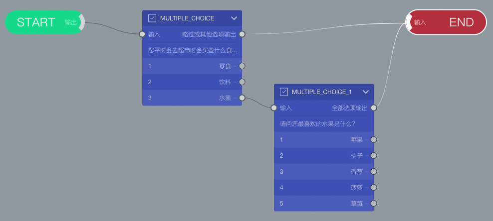

```index
4
```
```tag

```
```summary

```
# 设定题目跳转

问卷通过连线连接题目间的`输入端`和`输出端`设定题目间的跳转。

画布上每个题目节点都有一个`输入端`和若干`输出端`。


## 输出端
鼠标拖动`输出端`，可以拖出一条连线，连线只能从`输出端`开始。

## 输入端
拖动连线，在`输入端`上放开鼠标，在`输出端`和`输入端`之间建立了一条连线。

## 连线
连线代表问卷执行的流程走向，从一个题目节点输出到下一道题目的输入。一条连线所连接的`输出端`和`输入端`，代表了2道问卷题目的跳转。


## 试一试

画布上的`MULTIPLE_CHOICE`节点是创建问卷时，自动创建的性别选择节点。选中`MULTIPLE_CHOICE`节点，把它的问题改为：您平时会去超市时会买些什么食物？，选项改为：零食、饮料、水果。

随后，拖动`MULTIPLE_CHOICE`节点`水果`选项的输出端口，将拖动出来的连线连接到`MULTIPLE_CHOICE_1`节点的输入端。

再拖动`MULTIPLE_CHOICE_1`节点顶部的`略过或其他选项输出`的输出端口，将连线连接到`END`节点的输入端。

最后完成的连线如下图所示：

