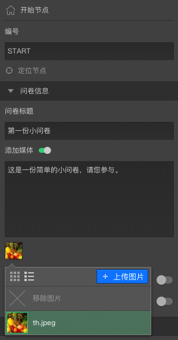
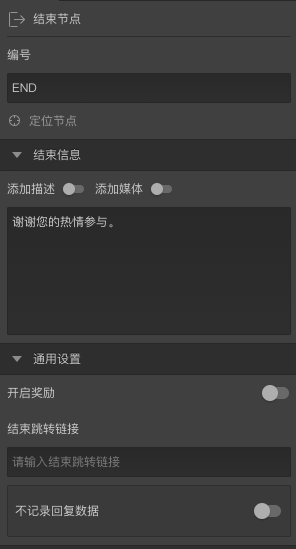

```index
5
```
```tag
设定开始和结束节点 试一试 设定开始节点 添加问卷封面描述文字和封面图片 添加问卷结束文字 案例
```
```summary
设置问卷封面和结束信息。
```
# 设定开始和结束节点

问卷只有1个`开始`节点，默认情况下只有1个`结束`节点。在创建问卷时，也为这2个节点创建了初始化的文本。

## 试一试

## 设定开始节点

### 添加问卷封面描述文字和封面图片
选中`开始`节点，输入问卷封面文字：这是一份简单的小问卷，请您参与。

然后打开`添加媒体`开关，点击`问卷封面文字`输入框下的图标上传问卷封面图片。



### 添加问卷结束文字
选中`结束`节点，输入问卷结束页面文字：谢谢您的热情参与。


