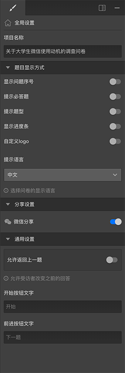

```index
6
```
```tag

```
```summary
问卷全局设定。
```
# 问卷全局设置

用于设置问卷的全局基本属性，当点击画布空白区域，没有选中画布中的任何内容时，右侧属性编辑栏会显示该问卷的全局设置选项。



## 试一试

### 显示问题序号
打开`显示问题序号`，问卷页面上会显示题目的数字序号。

### 显示进度条
打开`显示进度条`，问卷页面上方会显示问卷回复的进度条。


