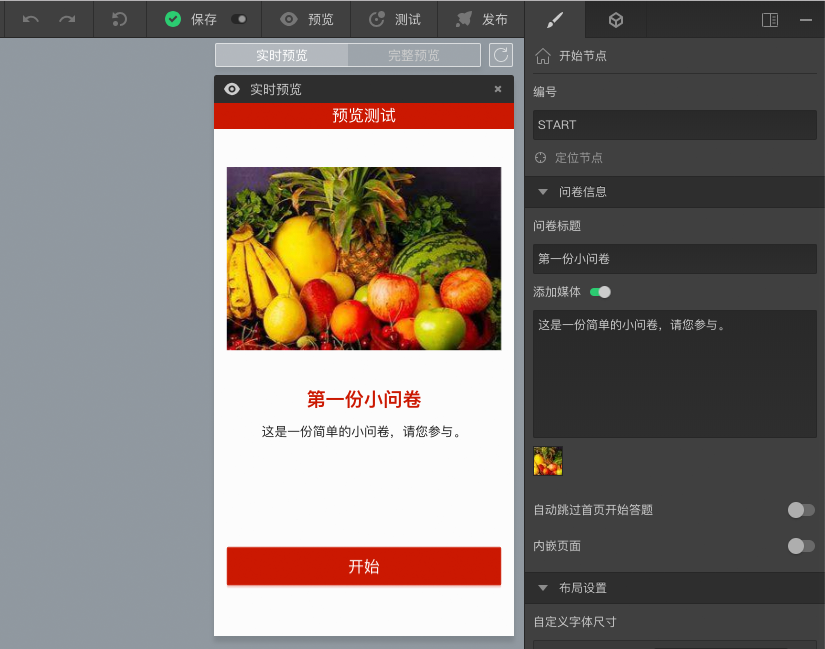
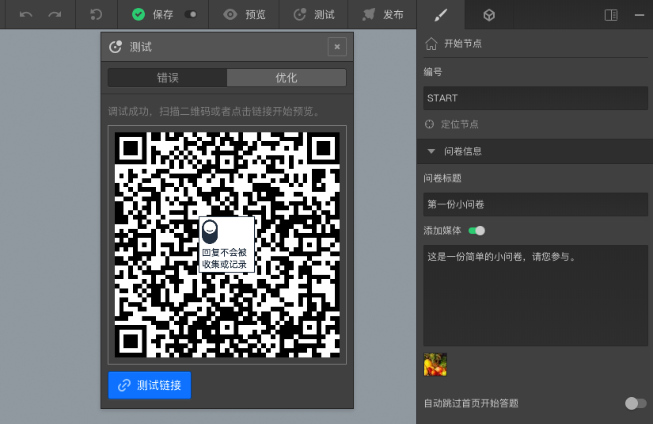
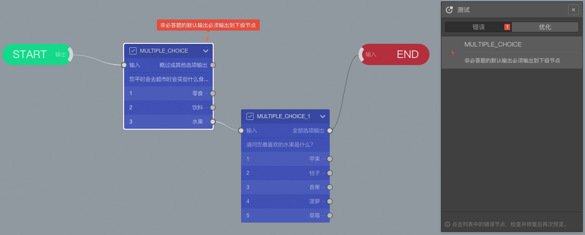

```index
7
```
```tag
问卷预览 问卷测试 试一试 错误提示 案例
```
```summary
看看题目的显示效果，体验下问卷的整体流程。
```
# 问卷预览和测试

完成前面的各项工作后，问卷就已经设定完毕了。但通常，我们需要检查一下问卷是否正确。问卷预览用于查看具体的一道题目，问卷测试用于检查和测试问卷的整个流程逻辑设定。

## 试一试

### 问卷预览
点击顶部`问卷发布工具栏`的`预览`按钮，打开`问卷预览`窗口，默认为`实时预览`模式。此时，会显示当前选中节点的预览效果。当我们选中`START`开始节点时，预览效果如下图所示。



### 问卷测试
点击顶部`测试`按钮，弹出的面板上会显示问卷测试二维码和测试链接，收集扫码后可以在手机上测试，或者直接点击链接在电脑上测试。



> 打开`问卷预览`窗口，切换为`完整预览`模式，也能进行问卷测试。

### 错误提示
刚开始测试时，问卷有时会包含错误，系统会智能地检查问卷错误，并给予提示。现在选中`MULTIPLE_CHOICE`节点到`结束`节点的连线，按键盘`DEL`键断开连线。`MULTIPLE_CHOICE`节点顶部会出现红色闪电图标，提示这个节点有错误发生。此时，点击`测试`按钮，弹出的面板上就不会会显示问卷测试二维码和链接了，而是错误提示信息列表。

点击错误提示信息列表里的错误项目名称，快速定位到错误节点。


