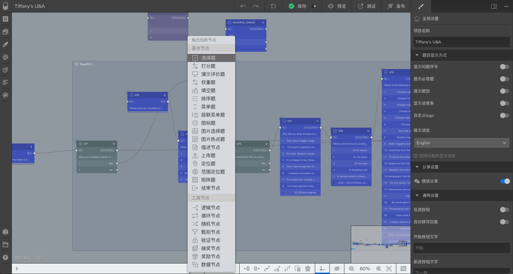
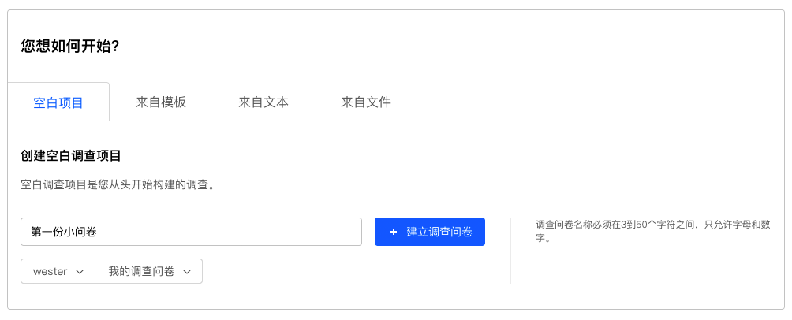
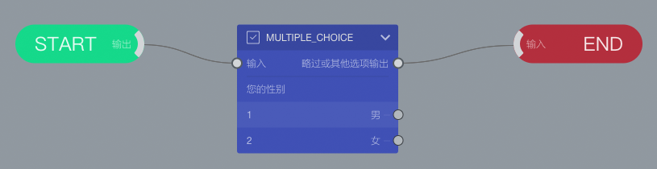
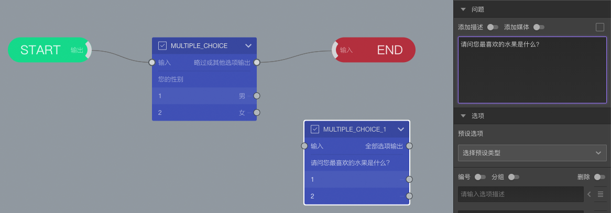

```index
1
```
```tag

```
```summary

```
# 增加问卷题目

可以通过下面3种方法，增加问卷题目。

+ 打开节点库面板，点击`节点`面板里的题型节点。
+ 打开节点库面板，直接拖动`节点`面板里的题型节点到画布里。
+ 按住`Shift`，同时拖动画布上某个节点的输出端到空白位置放开鼠标，在弹出菜单里选择题型。



## 试一试

### 建立一份空白问卷
首先，创建一份空白问卷，设定名称为`第一份小问卷`。



系统默认会为空白问卷生成1个`START`开始节点节点、1个`END`结束节点和1个`选择题`节点。



### 增加题目

打开节点库面板，点击`节点`面板里的`选择题`节点，添加一道选择题到画布上。



选中`MULTIPLE_CHOICE_1`节点，在右侧`属性编辑栏`中设定问题题目内容为：`请问您最喜欢的水果是什么？`。