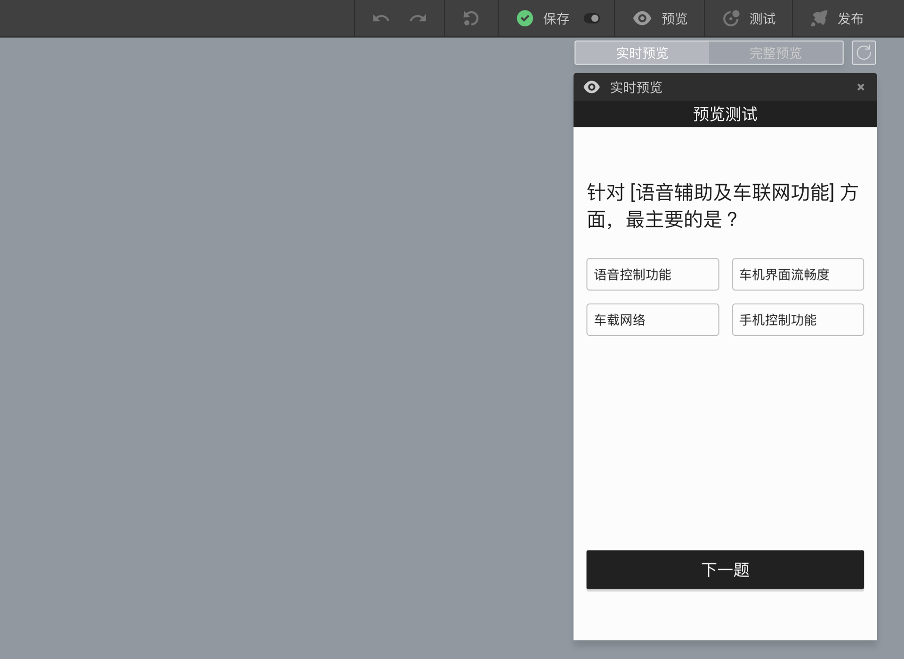

```index
2
```
```tag

```
```summary

```
# 实时预览和完整预览
点击`问卷编辑器`顶部`问卷发布工具栏`上的`预览`按钮，打开`问卷预览面板`。

面板顶部是`实时预览`和`完整预览`模式切换按钮。`实时预览`用来预览单个题目，`完整预览`用来预览整份问卷。点击按钮切换预览模式。默认为`实时预览`模式。


## 预览布局
默认采用手机终端的预览布局，可切换为平板、电脑终端布局。

## 实时预览
`实时预览`用来预览单个题目。此时，在画布中选择某个节点后，面板中会显示该节点在答题页中的展示效果，但无法前进后退到问卷的其他题目。修改节点属性时，展示效果会实时同步刷新。



如果问卷中包含[组合](../17advancedFunction/groupAndModule.md#组合的其他功能)，并且设定为`组内容节点显示为一页`，此时，在画布中选中该组合后，`实时预览`页面能看到组合中的全部题目。

# 完整预览
`完整预览`用来预览整份问卷。进入`完整预览`模式后，会触发`自动保存`。保存完毕后，预览面板会停在问卷封面，用户点击`开始`就可以模拟被访者答题了。答完一道题后点击`下一题`继续后面的问卷题目。随着问卷的进程，画布会自动选中当前题目并定位到画布中间，从视觉上立刻知道当前做到了问卷的哪个位置，所以特别适用于测试问卷流程和分支。


如果预览过程中，修改了问卷内容，需要点击`完整预览`按钮边的`刷新`按钮加载最新的问卷内容，从头开始预览。

> 存在错误的问卷，打开`完整预览`时会提示错误提示，参见[错误检测与调试](../06preview/03debugAndTest.md)。

`完整预览`的过程基本和正式答题的过程一样，除了以下几点：
+ 正式答题页面不会有顶部的预览测试条及预览工具按钮。
+ 完整预览中针对[验证节点](../10nodes/toolsNodes/05verify.md)不会真进行验证，填入任何内容都可通过。
+ 完整预览中完成问卷后不会提交数据。
+ 完整预览中的结束页面会有一个`返回测试`的按钮，方便预览者回到之前的题目，正式答题页面不会出现这个按钮。
+ 完整预览中的抽奖和领奖都是模拟的，不会产生任何奖励。
+ 完整预览中会拒绝跳转到`结束跳转链接`。

> `实时预览`多用于在问卷编辑过程中，一边编辑设定题目属性，一边查看编辑后的效果。
