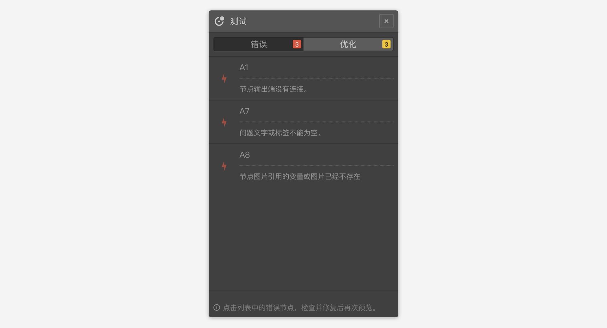
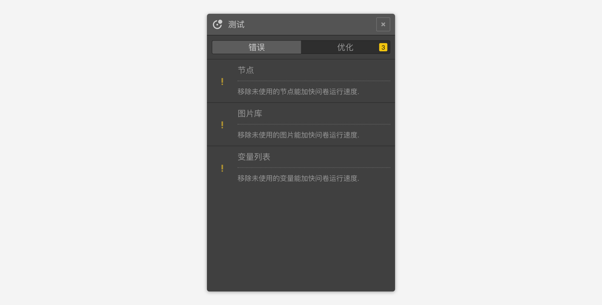

```index
3
```

```tag

```

```summary

```
# 问卷测试

问卷编辑器的智能引擎会持续检查问卷是否包含错误，包含错误的问卷可以保存，但无法[完整预览](./02realTimeAndFullPreview)和[发布](../08publish/concept.md)。

## 查看问卷错误和优化建议

### 问卷错误和优化建议列表
点击顶部`问卷发布工具栏`上的`测试`按钮打开问卷测试面板。面板中展示了问卷的错误列表和优化建议。

+ 错误列表中的错误必须得到修复才能进行完整预览和发布。



+ 优化建议能精简问卷运行时必须加载的资源，运行更顺畅。但是无论是否按优化建议中的修改问卷，都不会影响问卷的完整预览和发布.
  


点击错误项或者优化项，快速定位到问题发生的位置，便于判断并修复问题。

如果测试下来没有问题，就可以`发布`问卷，系统将生成正式的问卷二维码和链接地址。

### 问卷错误的界面提示
除了问卷测试面板中会展示问卷错误外，其他界面元素也会展示检测到的错误，例如：
+ 题目节点的右上角：如果该节点有错误，则画布中该节点的右上角会显示一个红色闪电图标，鼠标放在红色闪电上将会浮出具体错误消息。
+ 变量列表：如果变量存在错误，该变量会显示成红色字体，`变量设置`面板中会展示错误消息。
+ 内置接口列表：代码或参数不正确时，该变量会显示成红色字体，`接口设置`面板中会展示错误消息。
+ 接口请求： 接口请求中设置错误时，会在`编辑`面板中显示错误消息。
+ 数值输入框：输入的数值有错误是，输入框会变成红色，鼠标放上去后会浮出错误消息。
+ 内嵌变量标签：内嵌的变量标签出现错误，会变成红色，点击标签会展示错误消息。
+ 选项引用：出错后引用项会变成红色，点击后会弹出错误消息。
+ 图片或视频选择器：媒体资源存在错误时，选择器按钮会变成红色边框，鼠标放上去后浮出错误消息。
+ 逻辑条件：如果某条逻辑条件的设置存在错误，则其展示文字会变成红色，`逻辑编辑`面板中对应的设置项也会变成红色。
+ 选项控制设置：出错后，选项控制入口按钮图标会变成红色，对应的设置面板中，关联的设置内容也会显示为红色。

## 测试问卷
修复所有问卷错误后，错误列表会消失，并生成问卷测试二维码和测试链接，扫描二维码或点击链接可以对问卷的完整答题流程进行测试。问卷测试不会提交问卷结果数据。


