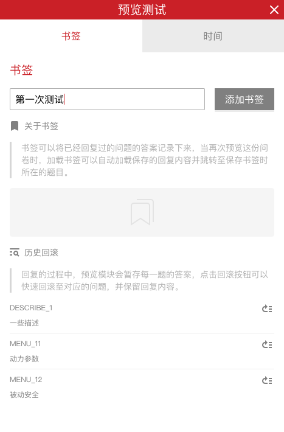

```index
4
```
```tag

```
```summary

```
# 预览测试进度书签
在预览和测试过程中，保存进度书签可以节约测试时间，对于已经肯定正确的内容，保存`进度书签`，后面就可以直接从书签位置开始继续测试，不必每次都重新开始测试。



## 保存进度书签
`进度书签`按钮位于问卷预览页面头部`预览测试`提示条右侧，包含`书签`和`时间`2个功能。点击`书签`按钮，输入书签名称后点击`添加书签`按钮保存当前预览进度。

## 调取进度书签
打开`书签`工具页面，会看到之前保存过的所有书签，点击书签名称恢复到该书签保存的预览进度。

## 删除进度书签
点击该书签名称右侧的`删除`按钮删除书签。

如果保存`书签`后，又删除了节点的某些选项，恢复`书签`时，会因为问卷数据与书签数据不符而停在这道题目上。这时可以手动重新作答该题，然后继续后续的题目。

> `书签`页面底部还有个题目列表，这是当前所有作答过的题目列表，点击题目右侧的跳转按钮可重新快速跳回到该题目。