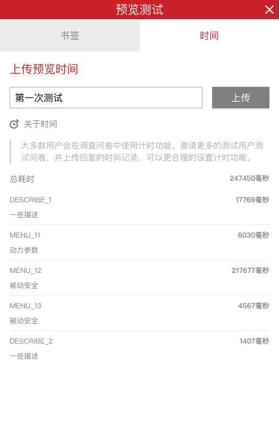

\```index

5

\```

\```tag

统计预览测试用时 保存问卷测试用时 测试用时 问卷预览 问卷测试 问卷预览

\```

\```summary

统计预览测试用时为您优化问卷题目提供建议。

\```

# 统计预览测试用时

问卷回复时长对被访者的体验是一个非常重要的属性，一般来说问卷越短，体验越好。系统提供了问卷回复用时统计功能，帮助用户统计、分析问卷的时长，为优化问卷提供参考信息。



## 保存问卷测试用时

问卷预览页面头部==预览测试==提示条右侧，包含==书签==和==时间==2个功能。点击==时间==按钮，在==时间==工具页面的下方，会列出预览过程中在回答每道题目上消耗的时间和全部题目上消耗的总时间。

输入名称标记并上传时间数据，测试用时数据会保存在系统里。用户打开==问卷编辑器==的[==计时器==](../04layoutOfEditor/03components/05timer.md)面板就能看到长传的时间数据，可用于统计、分析每道题目合适的作答时间。

