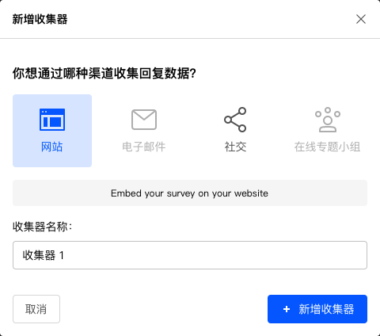

# 新建收集器

进入==问卷收集器==页面，系统会生成一个默认收集器。点击右上角==新增收集器==，为当前问卷增加一个收集器。可以为同一份问卷绑定多个设置完全不同的收集器。

## 收集器设定

新增收集器后，在弹出对话框中设定收集器名称，以及对应的收集器渠道。

系统支持以下4种不同的渠道：

+ 网站：可以在网站、微信、微博等多种渠道分享散播收集器链接，实现数据收集。
+ 邮件：上传邮箱地址列表后，系统自动发送收集器链接到列表中的邮箱地址。
+ 社交：用于绑定微信授权，在绑定微信授权下拉列表中选择绑定新的微信授权，系统会跳转到微信官方的授权页面，此时需要微信公众号管理员扫码授权，随后当在该公众号中分享传播收集器链接时，系统可以自动获得被访者的微信号，并记录在问卷结果总，便于持续跟踪数据，或进行更个性化的数据挖掘。选择该渠道后，目前仅支持在微信中完成问卷。
+ 在线专题小组：系统认证的样本库中收集数据。
  