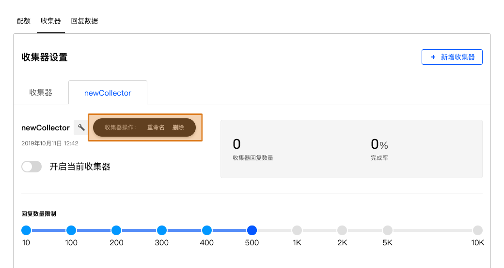

```index
2
```
```tag

```
```summary

```
# 收集器
收集器用于收集问卷数据，同一份问卷可以开启多个不同收集器。并且，每个收集器都可以有各自不同的名称和设定。



## 收集器名称
同一份问卷可以有多个收集器，所以为收集器命名可以提高辨识度。

## 重命名收集器
点击名称右边的🔧按钮，选择`重命名`，修改收集器名称。

## 删除收集器
点击名称右边的🔧按钮，选择`删除`，删除当前收集器。

## 收集器开关
开启后，问卷切换为不可编辑状态，并生成正式的问卷链接。正式问卷链接可以进行数据收集。点击切换收集器的开启/关闭状态。

## 收集信息概要
显示当前`收集器回复数量`，`当前配额回复数量`和`完成率`数据。