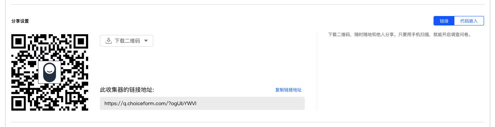
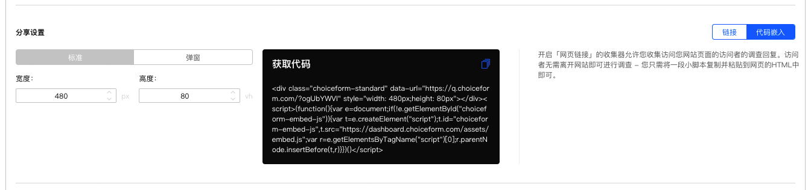
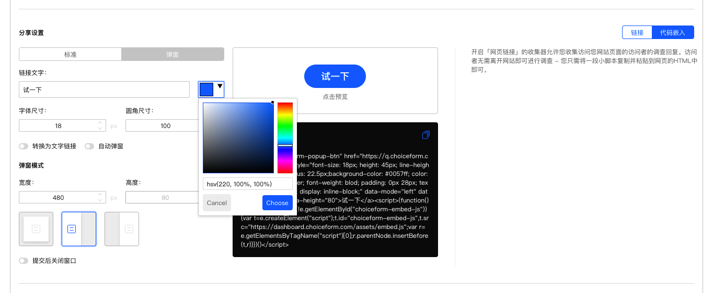
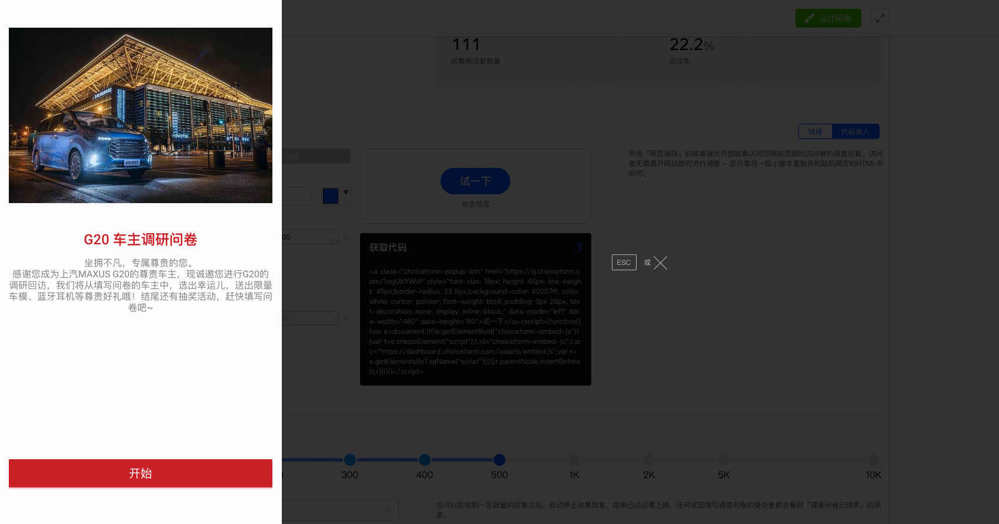

\```index

3

\```

\```tag

分享设置 问卷链接 问卷二维码 代码嵌入 标准嵌入问卷 弹窗嵌入问卷 问卷发布

\```

\```summary

除了问卷二维码和链接外，我想把问卷嵌入到我们的企业网站页面里，试试看代码嵌入。

\```

# 分享设置

## 问卷收集器链接和二维码

问卷收集器发布后，系统会生成正式链接和二维码，收集器一旦发布，正式链接和二维码就永远不会改变。



点击==下载二维码==，可选格式有PNG或者PVG格式。

## 代码嵌入

系统可自动生成问卷嵌入网站的代码，点击==代码嵌入==进行设置。

### 标准嵌入问卷

==标准嵌入==可在网站页面中直接嵌入问卷，可设置嵌入问卷的宽度和高度，



设定完毕后，系统将自动生成代码，点击代码区域右上方的复制代码按钮，再粘贴到你的网站代码中就可以实现问卷嵌入了。

### 弹窗嵌入问卷

==弹窗嵌入==会在网站页面中嵌入一个按钮，点击按钮后在网页上层叠加显示问卷，不会影响网页布局，又能实现问卷接入功能。

+ 链接文字和颜色：设置按钮提示文字和按钮颜色；
+ 字体尺寸：设置按钮文字大小；
+ 弹窗模式：设定问卷的宽度和高度，以及弹窗显示的位置，可选居中、居左、居右。
+ 提交后关闭窗口：提交问卷后自动关闭弹窗；
  


调整设置后，可以点击预览体验最终效果。



设定完毕后，系统将自动生成代码，点击代码区域右上方的复制代码按钮，再粘贴到你的网站代码中就可以实现问卷嵌入了。
