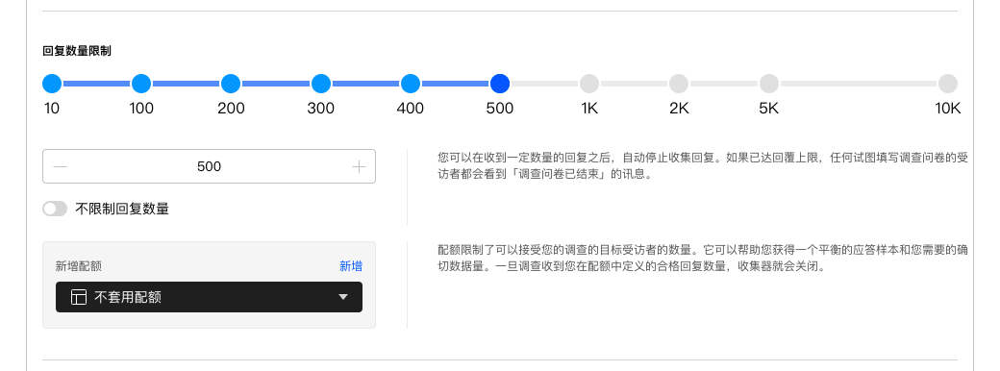
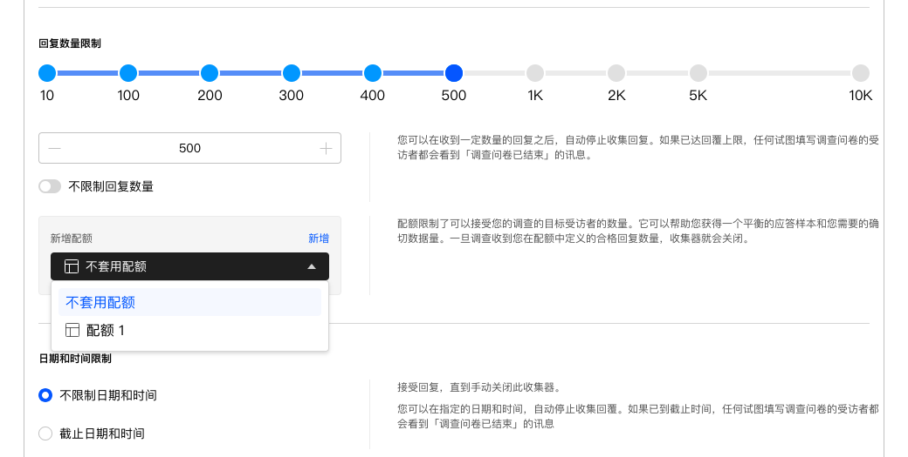

```index
3
```
```tag

```
```summary

```
# 回复数量限制
问卷发布之前，需要设定收集问卷数据的总量。



## 回复数量设定
输入数值，设置当前收集器收集问卷数据的数量，当收集到的指定数量的数据后，收集器会自动关闭。

## 不限制恢复数量
开启后，收集器会一直收集问卷回复数据，直到手动关闭收集器。

## 新增配额
除了设定数量，系统还支持使用指定的[配额设置](./quota.md)作为回复数量。点击回复数量输入框下方的配额列表，在弹出菜单里选择希望使用的配额。




使用后，`回复数量限制`自动会变成[配额设置](./quota.md)里的设定数量。或者，点击`新增`生成一个新配额。