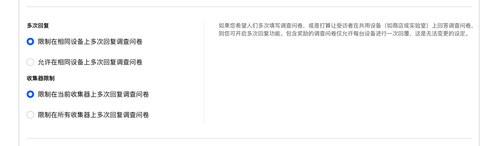

```index
6
```
```tag
多次回复和收集器限制 多次回复 收集器限制 问卷发布
```
```summary
被访者多次回复同一份问卷可能会对数据结果产生潜在影响，设定您个性化的多次回复和收集器限制策略。
```
# 多次回复和收集器限制



## 多次回复
用于控制在同一台设备上是否允许对同一份问卷进行多次回复。如果问卷包含了奖励，则自动设定为同一设备上只允许回复一次，不允许多次回复。

+ 限制在相同设备上多次回复调查问卷：同一个设备终端上，同一个被访者只能回复一次。
+ 允许在相同设备上多次回复调查问卷：同一个设备终端上，同一个被访者能多次回复问卷。

## 收集器限制
由于同一份问卷可能包含多个不同设置的收集器，`收集器限制`用于控制同一设备上是否允许对同一份问卷的多个不同收集器进行问卷回复。

+ 限制在当前收集器上多次回复调查问卷：通过此收集器链接，同一个被访者只能回复一次。
  
+ 限制在所有收集器上多次回复调查问卷：如果问卷有多个收集器，并且被访者通过当前收集器回复了问卷，则不允许该被访者在同一问卷的其他收集器再次进行回复。