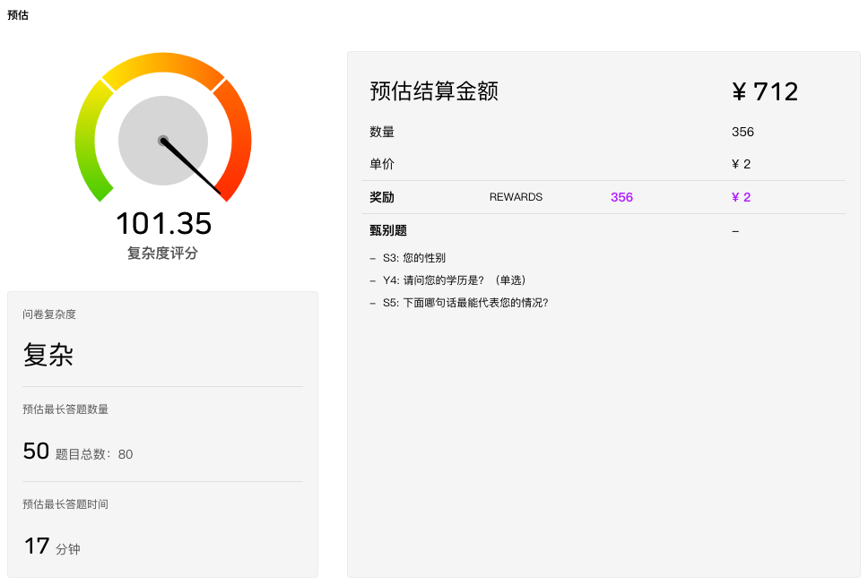

# 预估

问卷设计完毕后，系统会对问卷难度进行预估，基于对历史问卷回复时间的大数据分析，综合问卷的题目数量、选项数量、题目类型等等因素，对问卷难度打分并给予评级，为确定项目执行策略提供参考。

## 复杂度评分

对问卷复杂度进行评分，以码表形式表现，复杂度并不以100分为限制，随着问卷复杂程度对增加，超过100分是完全可能的。此外，系统还会分析极端情况下被访者可能需要完成的题目数量，以及可能需要的完成时间。

## 预估结算金额

根据问卷的数量和红包单价设定，估算所需要的红包奖励。下方甄别题区域列有问卷的所有甄别题目清单，方便用户快速评估。

