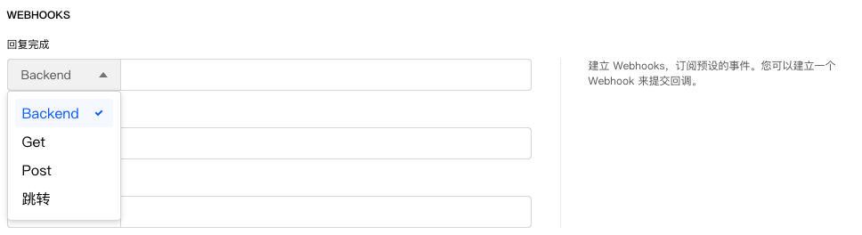

```index
8
```
```tag
Webhook Webhook设置 Webhook地址修饰符 在网址中注入变量 问卷发布
```
```summary
设置问卷Webhook触发事件，当发生特定事件时触发指定的处理流程，例如与样本库实现状态对接等。
```
# Webhook设置
Webhook是一个轻量的事件处理应用，在指定世界发生时立即调用。`巧思系统`的每个收集器都支持Webhook，可以为`回复完成时`，`回复不合格时`，`恢复超过了设定的配额时`事件设定Webhook地址，当事件发生时，就会调用地址并传出参数。



## Webhook地址修饰符
填写的网络地址可以有以下方式：

+ 直接`http`或`https`开头的网址
  例如`https://www.choiceform.com`，则发生情况后会直接跳转到该网址页面。

+ 以`GET:`开头再加上网址
  
  例如`GET:https://api.choiceform.com/test?number=1&name=lqq`，则事件发生后会在前端以`GET`方式调用这个接口，后面可以附加参数，请求参数将会拼接到url的后面。

+ 以`POST:`开头再加上网址
  
  例如`POST:https://api.choiceform.com/test?number=1&name=lqq`，则事件发生后会在前端以`POST`方式调用这个接口，请求时参数会放到HttpRequest的body中。

+ 以`BACKEND:`开头再加上网址
  
  例如`BACKEND:https://api.choiceform.com/test?number=1&name=lqq`，则事件发生后会在后台调用这个接口，后台调用默认以`POST`方式调用。

## 在网址中注入变量
  
网络地址中还可以通过`{{varName}}`的方式注入问卷编辑器中的[变量](../../16variable/01concept.md)，而且只能注入[显式变量](../../16variable/01concept.md#显式变量)和[系统变量](../../16variable/09buildinVariable.md)。

例如：
  
问卷链接中带入了员工姓名参数，问卷内容中要求输入员工工号，在Webhook里，希望能把员工工号和姓名传出去。

假设员工姓名叫`lucy`，通过问卷链接最后添加`key1`参数的形式注入，参考形式为：`[问卷链接]?key1="lucy"`，Webhook的目标地址为：`https://www.choiceform.com`。
  
这时，需要注入2个变量：`var1`和`key1`：
+ `var1`：
  
  这是一个`显式变量`，显式变量注入时需要确保在问卷编辑器中已经创建了一个名叫`var1`的变量，这里可以对应到问卷里面一道提示输入员工工号的题目；

+ `key1`：
  
  `key1`是问卷编辑器中内置的`URL参数变量`，被访者打开问卷页面时，会解析出这些变量的值。

根据以上各项，最终的Webhook地址应为：`https://www.choiceform.com?number={{var1}}&name={{key1}}`。

被访者 `lucy`回复问卷时，`key1`解析到的值是`lucy`，如果她输入了员工工号`000`，那么`var1`解析到的值是`0001`。最后跳转的真实地址会是：`https://www.choiceform.com?number=0001&name=lucy`。


  

