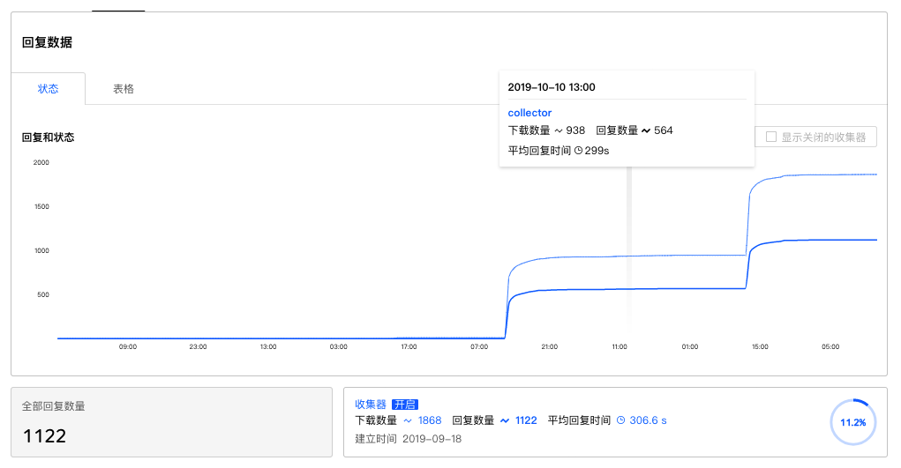
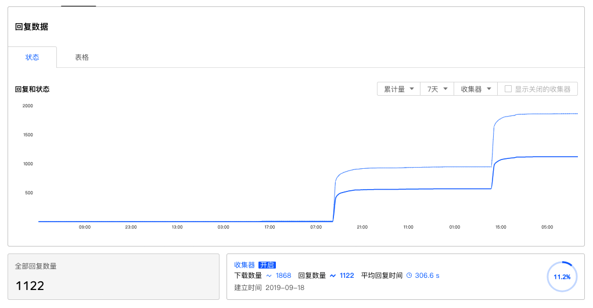
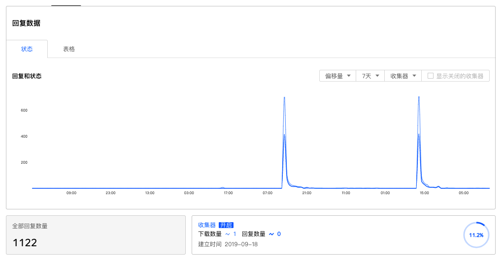
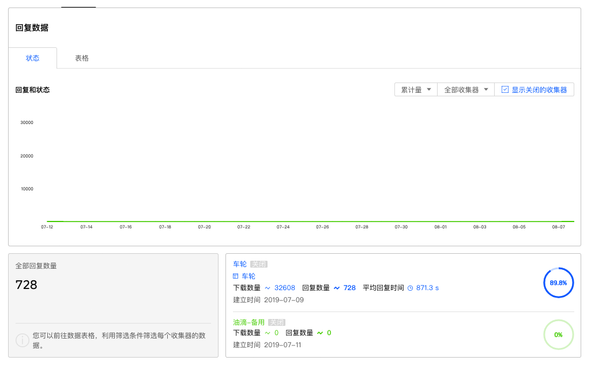

```index
1
```
```tag

```
```summary
掌握问卷收集数据进程，图表展现每小时、每天的问卷收集数量变化。
```
# 回复数据图表

当问卷开始收集数据后，系统会跟踪问卷所有收集器最近30天的进度数据，并汇总生成`回复进度图表`。图表以曲线图的形式绘制，纵坐标为收集数量，横坐标为时间。

当鼠标移动到回复进度图表上时，进度曲线上会浮现该时段的进度数据。


## 数据统计指标
系统默认按`累计量`绘制图表，记录的是每个收集器回复总量的变化。



可切换为按`偏移量`绘制图表，记录的是数据增量的变化数量



## 时间间隔跨度
系统默认按`1小时`绘制图表，每隔一小时记录每个收集器回复总量的变化。可切换时间间隔跨度，最高为30天。

## 收集器切换
当问卷有多个收集器同时收集数据时，会显示所有收集器的进度图表和进度数据汇总。



在收集器切换菜单中点选收集器名称，进度图表将仅显示选中收集器的进度图表。

## 显示关闭的收集器
默认情况下，系统仅显示已开启的收集器数据，当需要查看已关闭收集器的收集进度时，打开`显示关闭的收集器`即可。

## 回复数量统计
进度图表下方是回复进度数据统计。

### 全部回复数量
当前问卷所有收集器回复数量的总和。

### 收集器回复数量
全部回复数量右侧显示的是问卷每个收集器的回复数量统计，每个收集器一张数据卡片，卡片上主要有以下信息：
+ 收集器名称；
+ 收集器使用的配额名称；
+ 下载数量；
+ 回复数量；
+ 平均回复时间；
+ 收集器建立时间；
+ 收集器完成百分比；
