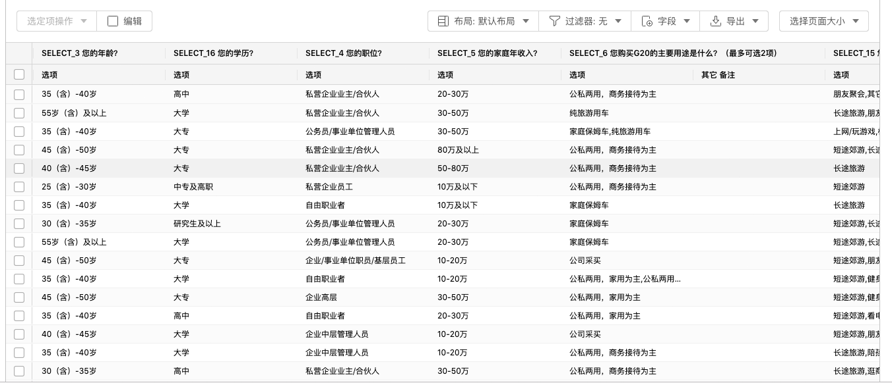
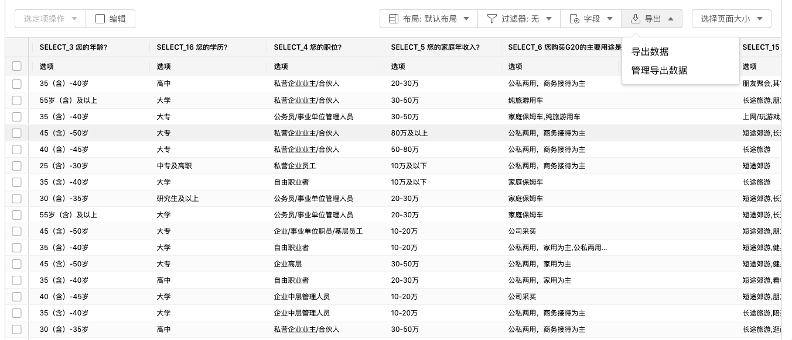
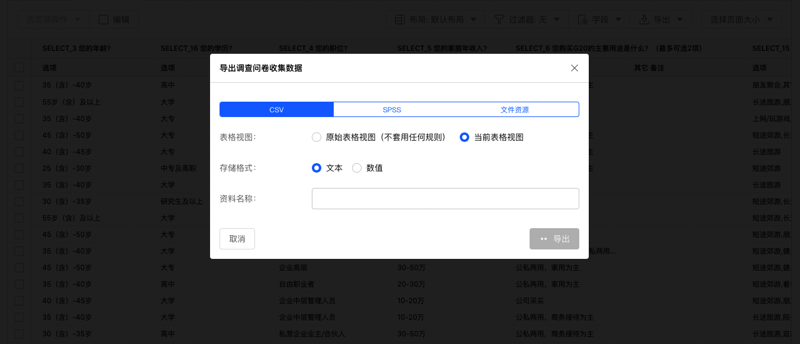
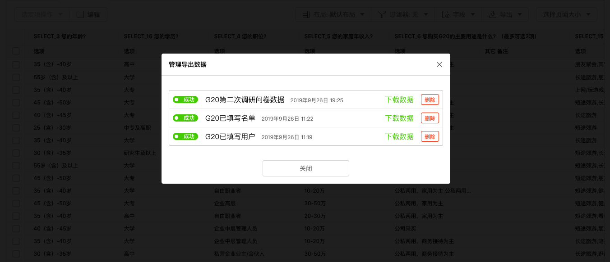
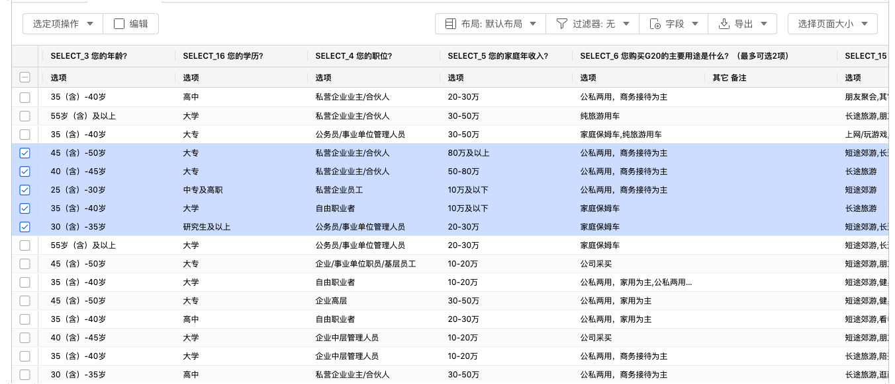
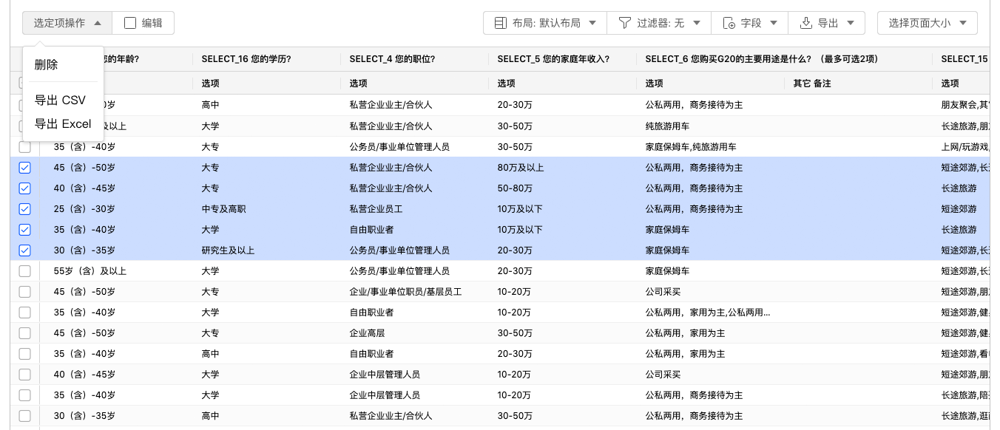

```index
2
```
```tag
导出数据 导出所有数据 表格视图 存储格式 资料格式 导出问卷的文件资源 下载数据 导出指定数据 选择数据行 导出指定的数据行 删除指定的数据行 数据表格 数据结果
```
```summary
输出问卷数据，支持CSV、SPSS格式，还可以打包下载被访者上传的文件。
```
# 导出数据
打开回复数据页面的表格面板，当前问卷的所有数据会以表格数据形式显示在页面中。



## 导出所有数据
点击`导出`，在下拉菜单中点击`导出数据`弹出导出数据对话框。



可选择CSV、SPSS格式导出数据文件，以及导出问卷的文件资源。



### 表格视图
用于控制导出的数据范围。
+ 原始表格视图：不套用任何数据过滤规则，导出问卷所有数据。
+ 当前表格视图：按当前表格视图导出数据，当套用了数据过滤规则时，此时仅导出过滤后得出的符合条件的数据。
  
### 存储格式  
用于控制导出数据方式，系统的题目和选项都可以进行编号，因此有时仅导出数值会更便于数据分析整理。
+ 文本：以文本方式保存数据。
+ 数值：以数值方式保存数据。
  
> 存储格式仅支持CSV格式导出。
  
### 资料格式
导出后生成的数据资料的名称。

### 导出问卷的文件资源
当问卷包含被访者上传的图片等资源数据时，选择导出文件资源。此时，系统会对问卷的文件资源进行压缩打包，每3000个文件资源存为1个ZIP文件。

## 下载数据
数据导出后会在云端创建对应数据资源，点击`导出`，在下拉菜单中点击`管理导出数据`弹出管理导出数据对话框。对话框中显示了云端存储的历次导出的问卷数据资源，点击数据资源名称旁的`下载数据`按钮下载数据文件。



点击`删除`按钮删除不再需要的数据资源。

## 导出指定数据
系统支持仅导出指定的数据。

### 选择数据行
数据表格中每行数据的最左侧都有一个勾选框，勾选后代表选中该行数据。也可以勾选数据表格最左上角的勾选框选中当前页所有数据行。



> 当问卷数据分页显示时，切换数据页会重置已勾选的数据。

### 导出指定的数据行
数据行选择完毕后，点击左上角`选定项操作`，选择将指定数据导出保存为CSV或者EXCEL格式的文件。



除了指定数据行外，系统还能对数据列进行带有条件的逻辑筛选，并将符合结果的数据导出。

### 删除指定的数据行
在数据表格中选择数据行，点击左上角`选定项操作`，选择`删除`。