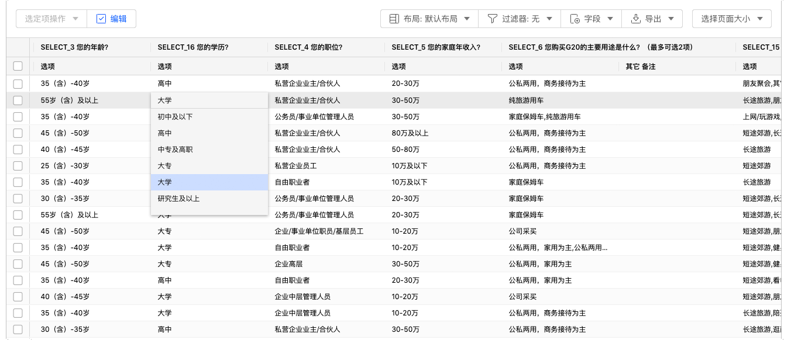

```index
3
```
```tag

```
```summary

```
# 编辑修改数据结果

有时需要对数据结果进行编辑修改。

## 编辑修改表格单元数据
勾选数据表格左上角的`编辑`选项，数据表格将进入编辑模式。

双击期望修改的数据表格单元，会弹出该题目的所有选项，重新勾选后更新选项数据。



并不是所有的数据字段单元都能编辑修改，某些系统自动生成的`提交ID`、`提交时间`等元信息无法修改。

## 在数据中插入数据列
在数据结果中插入数据字段也可以改变问卷的数据结果。
