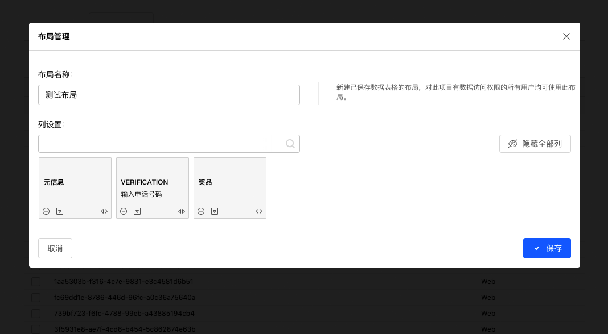
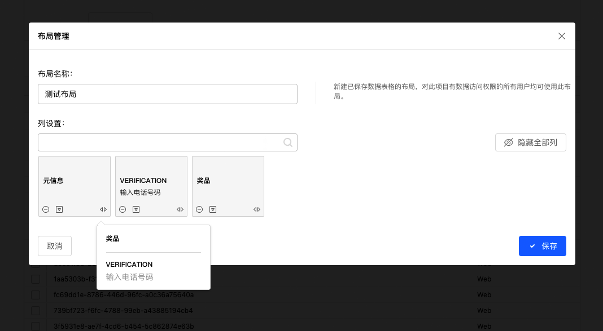
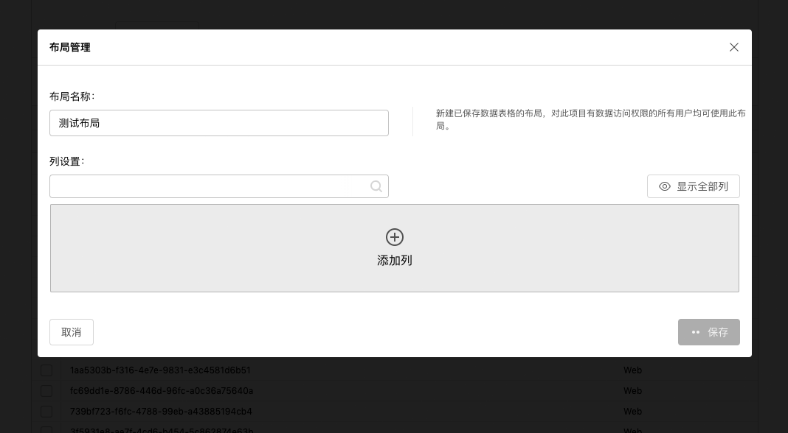
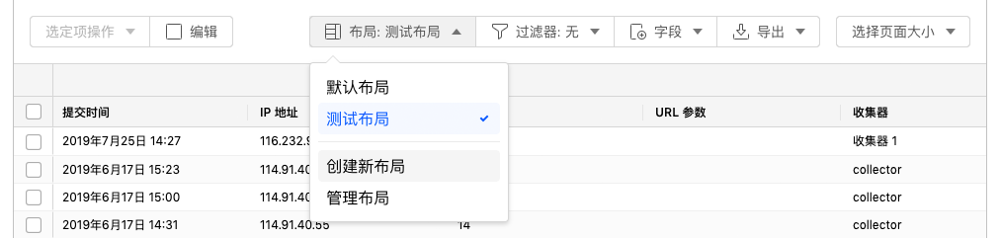

```index
4
```
```tag

```
```summary

```
# 创建数据表格布局
系统支持保存用户自定义的数据表格布局，并切换使用不同的数据表格布局。

## 创建新布局
点击数据表格右上方的`布局`按钮，在弹出菜单中点击`创建新布局`，打开`布局管理`对话框.



### 布局名称
设定当前布局名称并保存。
  
### 列设置
  
### 数据列卡片
为每列数据生成一张数据列卡片，数据列卡片的左右顺序代表最终数据表格中的数据列顺序。
  数据列卡片底部是数据卡片操作按钮，功能为：



+ 隐藏当前数据列。
+ **************************。
+ 移动当前数据列：点击后弹出显示当前所有可见的数据列名称，点选数据列名称后，将当前数据列移动到指定列之后。

+ 增加数据列：当数据列被隐藏后，数据列卡片上方左右角会显示2个添加数据列按钮。点击按钮弹出可添加的数据列清单，点选数据列后在当前数据卡片的左侧或右侧插入数据列。
  


### 隐藏全部列
当需要调整的数据列较多时，逐列调整数列据卡片很不方便，这时可以先隐藏全部数据列，再按期望的顺序添加数据列。点击`隐藏全部列`并确认后，会清空所有数列据卡片。
  


点击`添加列`，在弹出菜单中逐一添加数据列。

## 使用布局
保存布局后，点击数据表格`布局`按钮，选择切换不同的数据表格布局。



## 编辑布局
点击数据表格`布局`按钮，点击`管理布局`，在弹出对话框中点击`编辑`按钮编辑对应的布局。