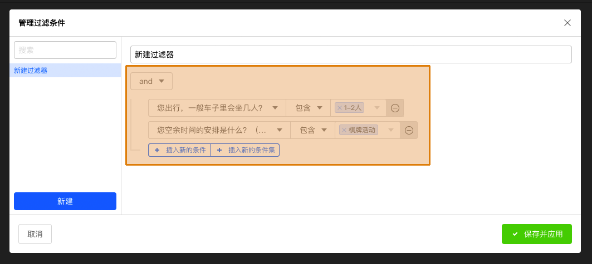
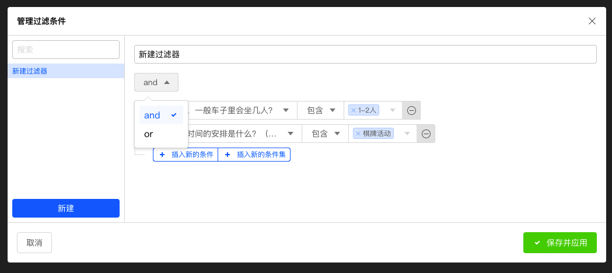
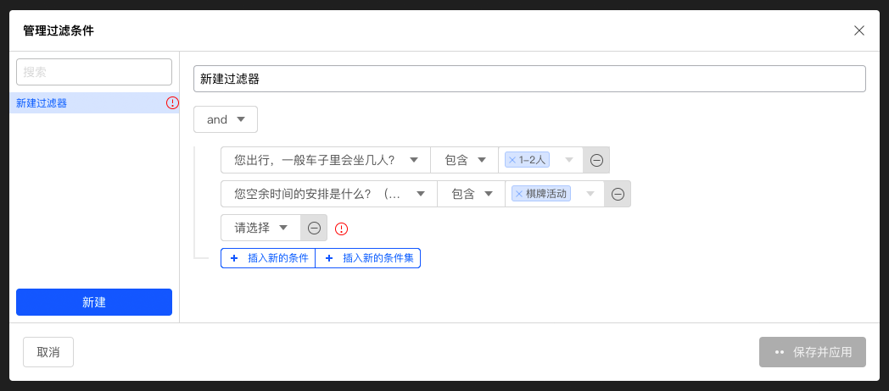
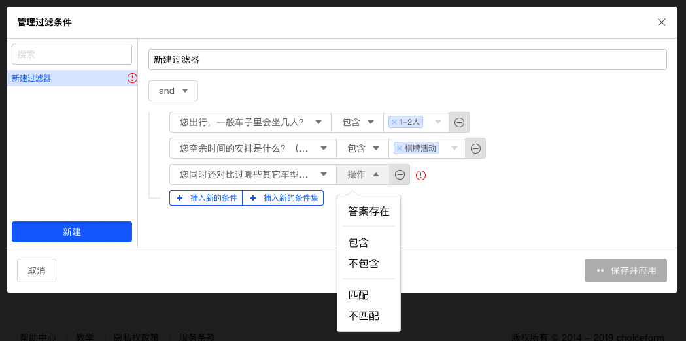
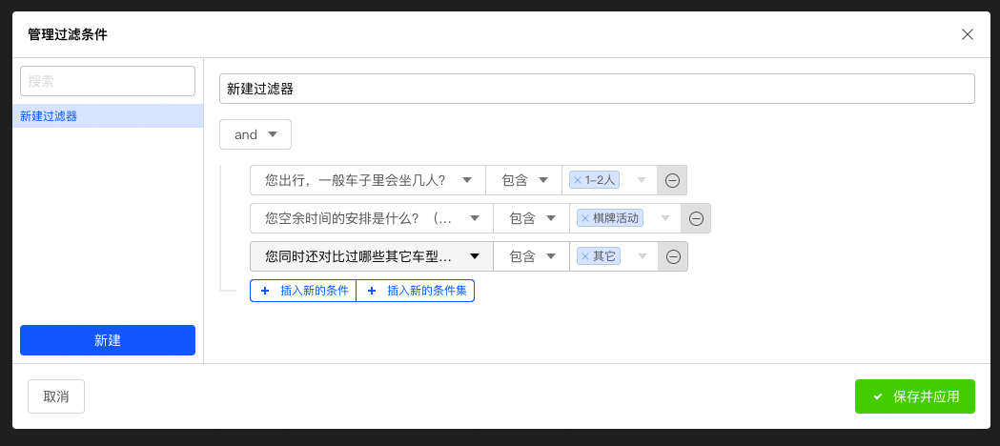
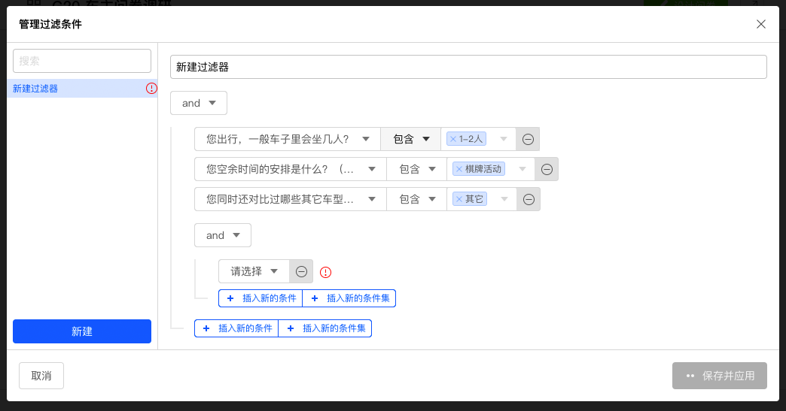
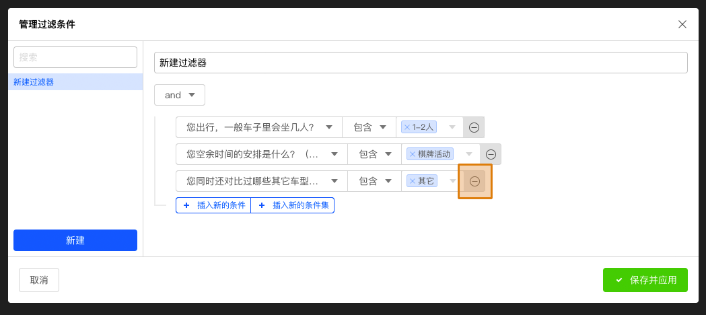
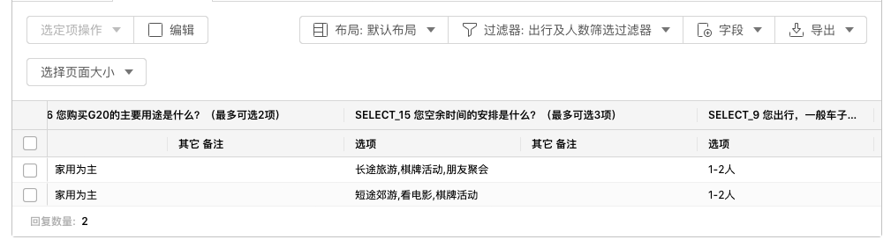
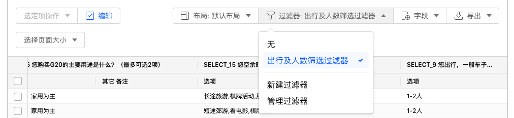
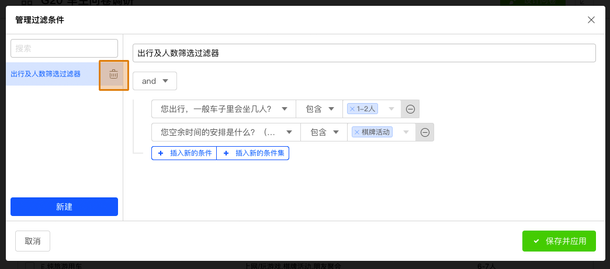

```index
5
```
```tag

```
```summary

```
# 过滤器
默认情况下数据表格包含了所有收集到的数据，使用数据`过滤器`可以对结果数据进行筛选，仅显示用户关注某些数据，特别是符合某些关联条件的数据。

点击`过滤器`在弹出菜单中选择`新建过滤器`，打开`管理过滤条件`对话框

## 设定数据过滤器
下图`管理过滤条件`对话框中的高亮区域是`数据过滤条件编辑器`。



图中，已经增加了2个数据过滤`条件`设定，分别是：
  + 询问出行时车内乘客人数的题目答案包含`1-2人`。
  + 询问空余时间安排的题目答案包含`棋牌活动`。

以上2个条件设定的逻辑运算方式为`AND`，点击菜单可切换为`OR`。



以上2个条件和运算方式设定构成1个数据过滤`条件集`。

### 插入新的条件
点击`插入新的条件`按钮，在当前`条件集`中增加1个新条件。



点击`请选择`弹出包含问卷所有题目的菜单，从中选择需要筛选数据的题目。

选择完毕后，题目右侧显示`操作`按钮，点击后弹出数据判断操作选项。



依次设定后，就完成了新增数据过滤条件的设定。



### 插入新的条件集
点击`插入新的条件集`按钮，在当前`条件集`中增加1个新条件集。



新条件集的设定方法与设定新条件相同。

### 删除数据过滤条件
点击数据过滤条件最右侧的`删除`按钮，删除当前条件。



### 保存并应用
保存前，设定过滤器名称为`出行及人数筛选过滤器`，设定完毕后，点击`保存并应用`，将自动过滤并显示符合条件的数据结果。



### 搜索过滤条件
在搜索框内输入内容，搜索匹配的数据过滤器。

## 切换数据过滤器
点击`过滤器`弹出当前所有数据过滤器列表，从中选择过滤器并筛选数据。



## 删除数据过滤器
当数据过滤器没有被使用时，`管理过滤条件`对话框里的过滤器名称右侧会显示`删除`按钮，点击后删除该数据过滤器。


