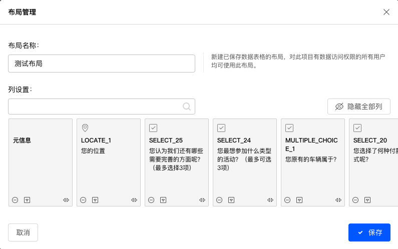

# 创建数据表格布局

系统支持保存用户自定义的数据表格布局，并切换使用不同的数据表格布局。

## 创建新布局

点击数据表格右上方的==布局==按钮，在弹出菜单中点击==创建新布局==，打开==布局管理==对话框.

默认情况下会按照目前的表格排列布局显示所有列，每列以一张卡片形式呈现，通过调整卡片位置排列新的布局，或者点击==隐藏全部列==后逐个添加需要显示的列，从而生成满意的布局。

## 隐藏全部列

当需要调整的数据列较多时，逐列调整数据列卡片很不方便，这时可以先隐藏全部数据列，再按期望的顺序添加数据列。点击==隐藏全部列==并确认后，会清空所有数据列卡片。

## 布局名称

设定当前布局名称。

## 列设置

设置当前布局列的排列规则。

### 数据列卡片

为每列数据生成一张数据列卡片，数据列卡片的左右顺序代表最终数据表格中的数据列顺序。

数据列卡片底部是数据卡片操作按钮，功能为：

+ 隐藏当前数据列。

+ 对当前数据列的选项进行排列。点击后，在当前数据列卡片下方展示对应的所有选项列，可隐藏选项列，或重新排列选项列顺序。

+ 移动当前数据列：点击后弹出显示当前所有可见的数据列名称，点选数据列名称后，将当前数据列移动到指定列之后。

+ 增加数据列：当数据列被隐藏后，数据列卡片上方左右角会显示2个添加数据列按钮。点击按钮弹出可添加的数据列清单，点选数据列后在当前数据卡片的左侧或右侧插入数据列。

点击==添加列==，在弹出菜单中逐一添加数据列。

## 使用布局

保存布局后，点击数据表格==布局==按钮，选择切换不同的数据表格布局。

## 编辑布局

点击数据表格==布局==按钮，点击==管理布局==，在弹出对话框中点击==编辑==按钮编辑所选的布局。
