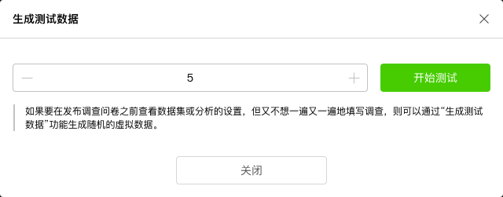
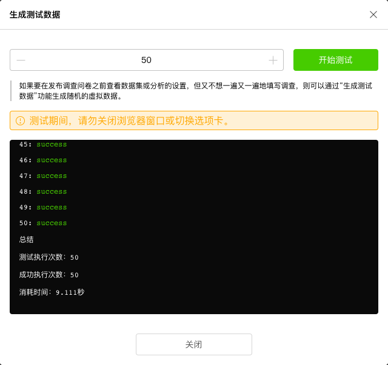
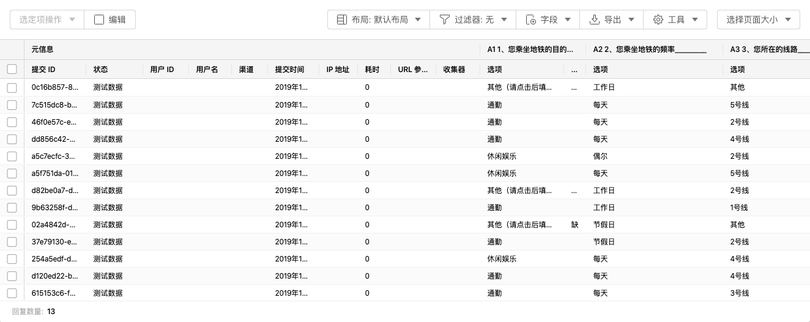
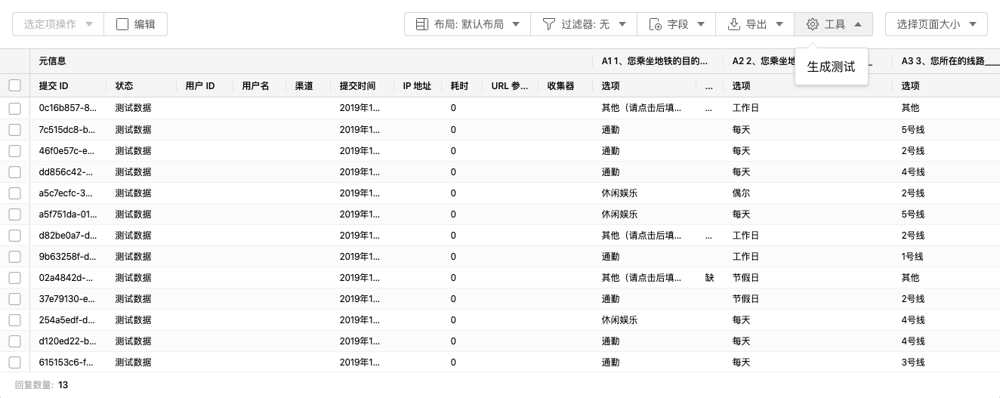
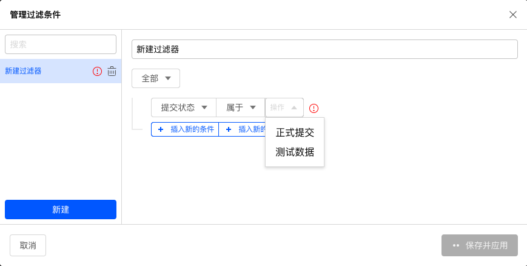

# 工具

## 生成测试

在问卷正式上线前，可以通过测试问卷体验被访者的回复过程，并检查问卷跳转逻辑和相关设定的正确性，但测试问卷数据不会被记录，这时可以使用生成cesium功能自动生成批量测试数据。

进入数据表格版块，点击生成测试按钮。

在弹出窗口中设定数量，随后点击开始测试。

系统开始自动生成测试数据，并反馈在对话框中，生成完毕后关闭对话框。

随后，可以看到系统已经生成相关测试数据，测试数据无法在系统中进行数据分析，但用户可以下载测试数据进行进一步检查。

## 添加测试数据

在工具下拉列表中点击生成测试，输入数量后，在当前数据结果中添加更多测试数据。

测试数据的状态列中的标记为测试数据，而问卷正式发布后收集的数据状态为正式提交，可以通过过滤器单独过滤出测试数据，或者正式提交数据。

