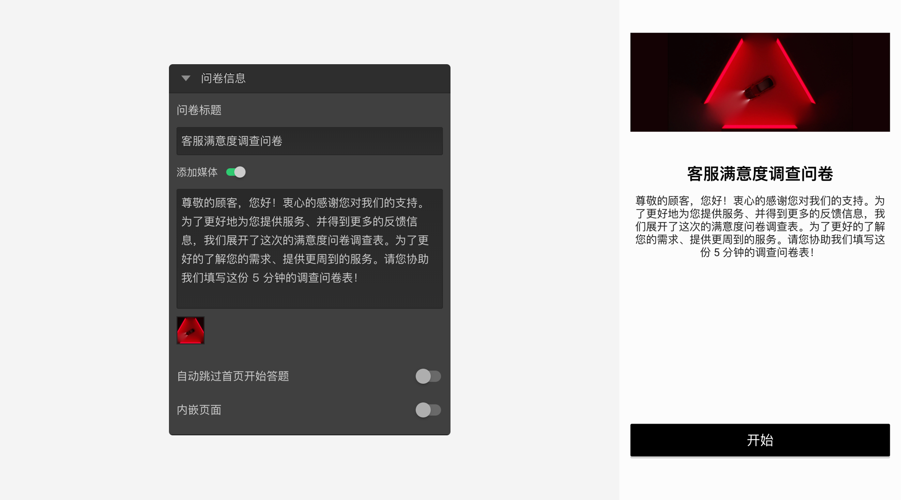

```index
1
```

```tag

```

```summary

```
# 开始节点

`开始节点`是问卷的封面，可以设定问卷标题、图片、说明等信息。一份问卷必须有，且仅有一个开始节点。答题开始时，先显示问卷封面，随后点击页面上的开始按钮正式开始问卷答题。


## 问卷信息


+ 问卷标题：
在问卷封面中展示的标题。如果不设置，封面上默认展示问卷项目名称。

+ 问卷描述：
问卷封面中展示的问卷描述。开启`添加媒体`后，上传问卷封面图片。

+ 自动跳过首页开始答题：
开启后，问卷封面的所有内容不会被展示给被访者，而是直接到问卷的第一道题目。

+ 内嵌页面：
指定一个URL地址，问卷封面中将会展示该URL地址的页面内容。

## 初始验证

`初始验证`可用于在问卷开始时判断用户资格，例如先请求CRM接口验证被访者是否是品牌俱乐部会员等。开启后，被访者开始答题前会先进行验证，如果未通过验证，则不可继续答题。

初始验证的规则与[自定义验证](../node-setting/custom-validation.md)相同，但是错误消息不可被禁用。

> 不同题型或功能节点共有的通用设置在[节点设置](../node-setting/concept.md)中有讲解，此处只讲解开始节点特有的功能。
