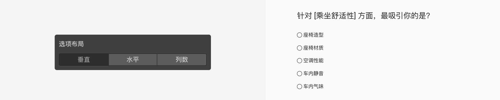
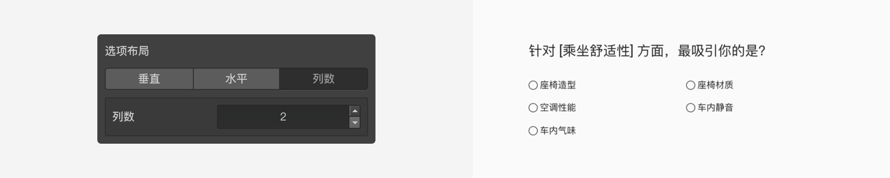

```index
1
```

```tag

```

```summary

```
# 选择题

`选择题`提供一系列选项给被访者，被访者从中选择一项或多项作为问题的答案。


当设置为多选时，选项之间可以进行互斥控制，通常用于选项间存在互相矛盾而无法被同时选中的情况。

> 设置为多选题时，根据所选选项决定后续问卷题目，需要使用[逻辑节点](../toolsNodes/01logic.md)进行逻辑判断。

## 选项设置

+ 预设选项：
`选择题`预设了一些常用的选项内容，点选即可直接使用预设的选项内容。具体内容参见[预设选项](../../11nodeSettings/03optionSetting/05presetingOption.md)。


选中一个预设选项后，根据不同的选中，左侧会智能地显示`范围`设定，进一步预设选项的数量和内容。


+ 选项备注
`选择题`默认包含一个`选项备注`的附加设置。点击选项右侧箭头，并开启`选项备注`后，当选中该选项时，下方会出现要求输入备注文字的输入框。

`选项备注`与`其他`选项的`选项+备注方式`非常类似，区别是`其他`选项的`选项+备注方式`支持输入验证。

+ 选项排他
当开启`多选题`后，选项设置的中还可以设置[选项排他](../../11nodeSettings/03optionSetting/02optionGroupAndExclude.md)。

## 布局设置

### 选项布局：
+ 选项布局：用于设置选项图标的排列方式，可选方式有：垂直、水平和指定列数。






+ 选项展示方式：用于切换选项布局。
+ 常规标记：选项左侧显示圆圈（单选）或方框（多选）作为选中标记。
  


+ 无标记：没有标记，选项文字外围显示矩形边框。
  


> 不同题型或功能节点共有的通用设置在[通用设置](../../11nodeSettings/concept.md)中有完整说明。