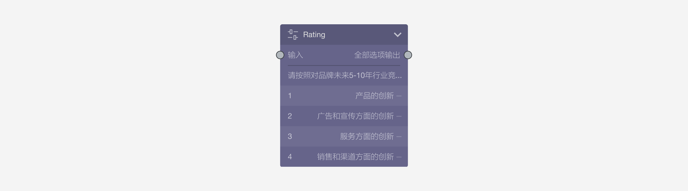
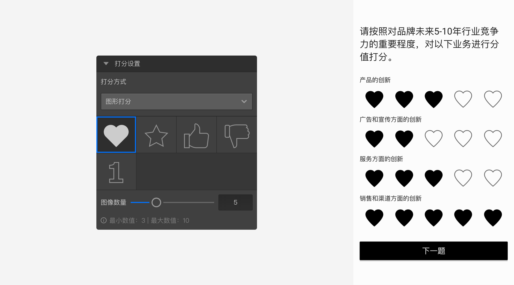
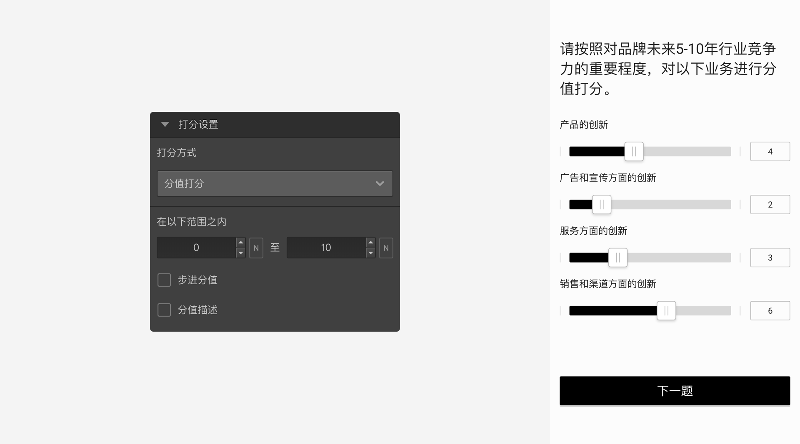
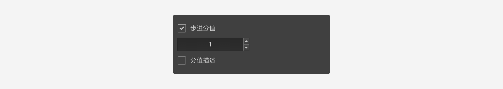
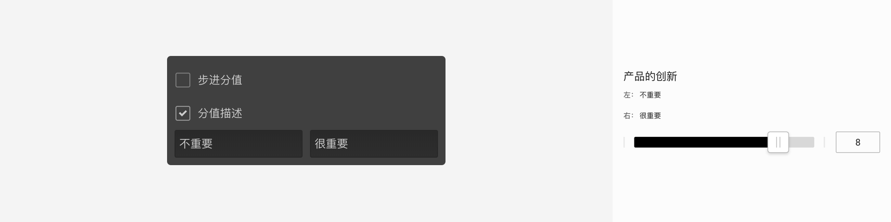
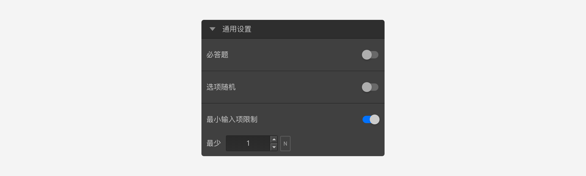

```index
2
```

```tag

```

```summary

```
# 打分题

`打分题`让被访者对选项进行打分。


## 打分设置

`打分题`有2种表现形式：`图形打分`和`分值打分`：

+ 图形打分
可以设置一个分值图形，并指定图像数量。答题页中，每个选项都会显示指定数量的图像，点击图形进行打分操作。


+ 分值打分
在答题页中会显示`分值滑动杆`，被访者拖动滑杆进行打分。可以设置的属性有`分值范围`、`分值步进`、`分值描述`。


  + 分值范围：即最小分值和最大分值，会显示在答题页滑杆的两端。
  + 分值步进：答题页中每次拖动滑杆所造成的分值变化幅度。

  + 分值描述：分别是对低分和高分的描述，文字会显示在答题页滑杆的两端。


## 通用设置

+ 最小输入项限制
设定必须被打分的选项总数量，参见[最小输入项验证](../../11nodeSettings/05questionGeneralSetting/03inputLimits.md)。


> 不同题型或功能节点共有的通用设置在[通用设置](../../11nodeSettings/concept.md)中有完整说明。

