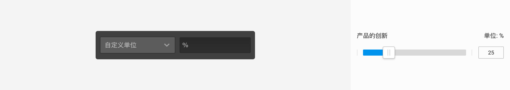
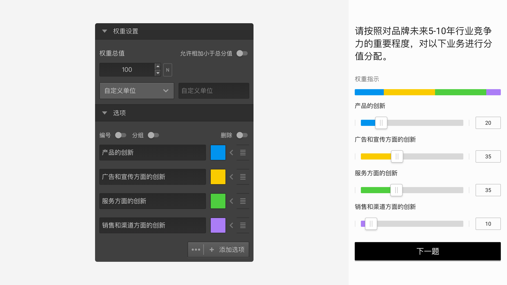

```index
4
```

```tag

```

```summary

```
# 权重题

`权重题`用于让被访者按选项提示对一个总量进行划分，比如确定各选项在总量中的占比。`权重题`操作类似`打分题`，滑动滑杆确定每个选项的分值，但增加了权重控制的功能。


答题页面的最上方会有一个权重指示条，以不同颜色显示各个选项在`权重总值`中的占比。

## 题型设置

+ 权重总值：
  所有选项的分值加起来不能超过该数值。

+ 允许相加小于总分值：
  


  开启后，允许所有选项的分值加起来小于总权重值，否则所有选项的分值加起来必须等于`权重总值`。

+ 自定义单位：


  设置选项分值单位。

## 通用设置

点击选项右侧的颜色设定，可以给每个选项设置颜色。



点击`附加设置`的小箭头图标，在`附加设置`中设置该选项允许的最大值。

> 不同题型或功能节点共有的通用设置在[通用设置](../../11nodeSettings/concept.md)中有完整说明。