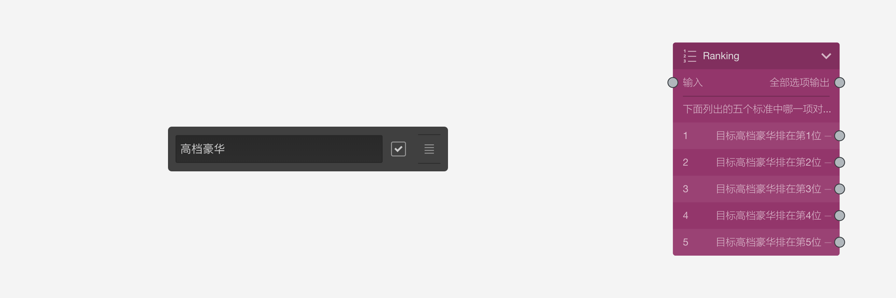
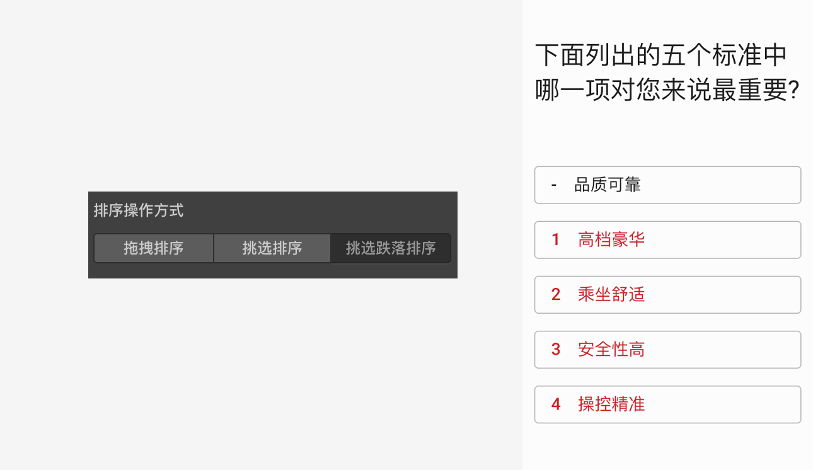

# 排序题

==排序题==关注的是选项的顺序，被访者按题目要求对题目选项排出先后顺序。==排序题==选项默认没有输出口。

被访者对选项进行排序时，按住选项右侧拖拽区域把选项拖出原来的位置，并放置到新的位置。当选项被移动到新位置后，选项前会显示一个排位序号数字。

## 选项设置

+ 排序目标：

有时，我们会关注某个选项的所在位置。此时，勾选选项右侧的==目标选项==勾选项，把该选项设定为目标选项，意味着这个选项是排序的关注目标。这时，画布中排序题节点的选项会出现输出口，代表如果目标选项被排到该选项所在的顺序位置，就从这里出去找下一题。

如上图中，我们勾选了==高档豪华==为排序目标，此时排序题节点的选项就可以输出连线了。当高档豪华被排到指定顺序位置后，就会接着显示这个选项连线所连接的题目。

> 默认只能把1个选项设定为排序目标，如果想关注多个排序目标，应使用[逻辑节点](../toolsNodes/01logic.md)。

## 通用设置

+ 设置排序数量：

默认情况下，==排序题==要求所有选项都被移动过位置，所有选项的序号都显示出来后才能进入下一题。设置==排序数量==后，可以避免所有选项必须被排序的限制，只要被排序选项的数量达到设定数量就可以进入下一题。

> 不同题型或功能节点共有的通用设置在[通用设置](../../11nodeSettings/concept.md)中有完整说明。

## 布局设置

用于设置排序操作方式，可选方式有：拖拽排序、挑选排序和挑选跌落排序。

+ 拖拽排序：

通过==拖拽==的方式排列，序号位置永远固定,选项的顺序会不停变化

+ 挑选排序：

通过==点击==的方式排列，点击哪个选项，就会给当前选项抢到当前还剩余的==最前面==的一个序号，然后在选项上表明排序号即可，无需调准选项的位置，再次点击已有需要的选项则取消该选项的序号。

+ 挑选跌落排序

通过==点击==的方式排列，点击生成序号时同挑选排序，但是放弃序号后，之前比当前选项排序号高的选项的序号都会坍塌跌落。

