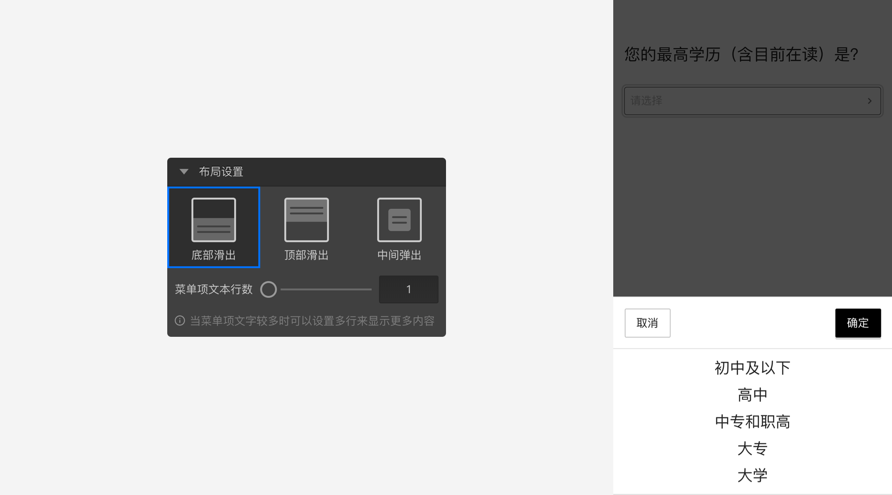
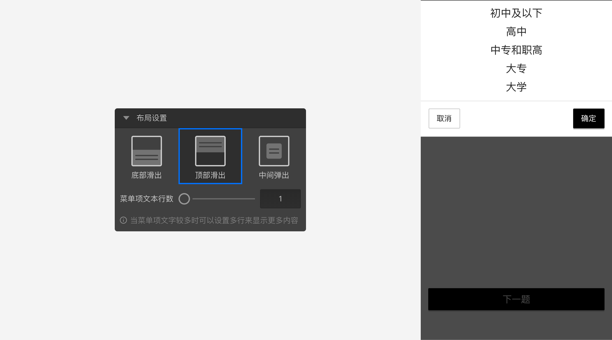
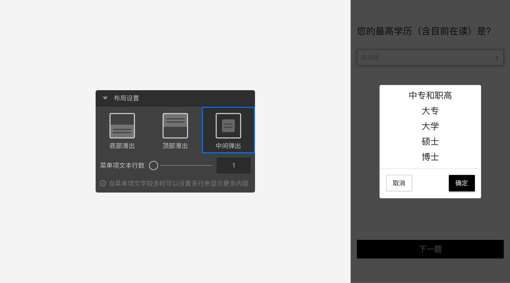

```index
7
```

```tag

```

```summary

```
# 菜单题

`菜单题`使用下拉列表的方式呈现题目选项供被访者选择。


## 选项设置

+ 预设选项：
菜单题预设了一些常用的选项内容，点选后会直接生成相关选项。目前的预设选项有：
  + 性别
  + 年龄
  + 婚姻
  + 学历
  + 行业
  + 职业
  + 职位
  + 收入
  + 同意/不同意
  + 满意/不满意
  + 可能/不可能
  + 熟悉度
  + 适量
  + 兴趣
  + 容易/难
  + 频率
  + 更好/更坏
  + 赞同/反对
  + 平均
  + 质量
  + 是/非
  + 意向
  + 有用度
  + 价值
  + 清晰度
  + 比重
  + 友好度

## 布局设置
菜单题的`布局设置`用于控制菜单弹出的方式和样式：

+ 菜单弹出方式：可设定为以下三种方式。
  + 底部滑出：
  
  + 顶部滑出：
  
  + 中间弹出：
  

+ 菜单项文本行数：控制每个菜单项里的文字的大小和行数，行数越多字体越小。当选项文字较多，系统会自动切断超长的文字。

  例如：
  单行文本数设定为1时的效果：
  

  单行文本数设定为2时的效果：
  

> 菜单题可以用来为级联题提供数据，参见[级联题](./cascade.md)。

> 不同题型或功能节点共有的通用设置在[通用设置](../../11nodeSettings/concept.md)中有完整说明。