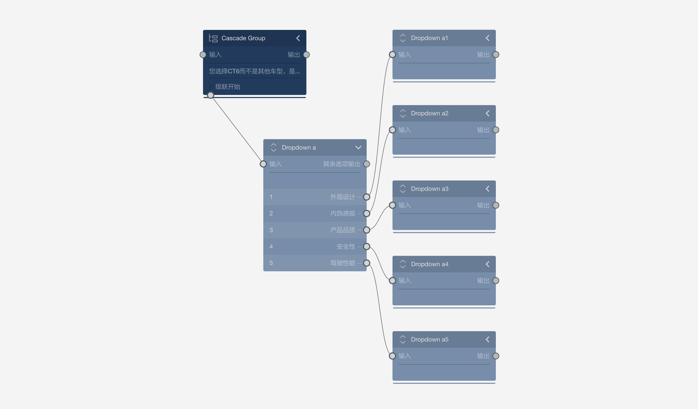
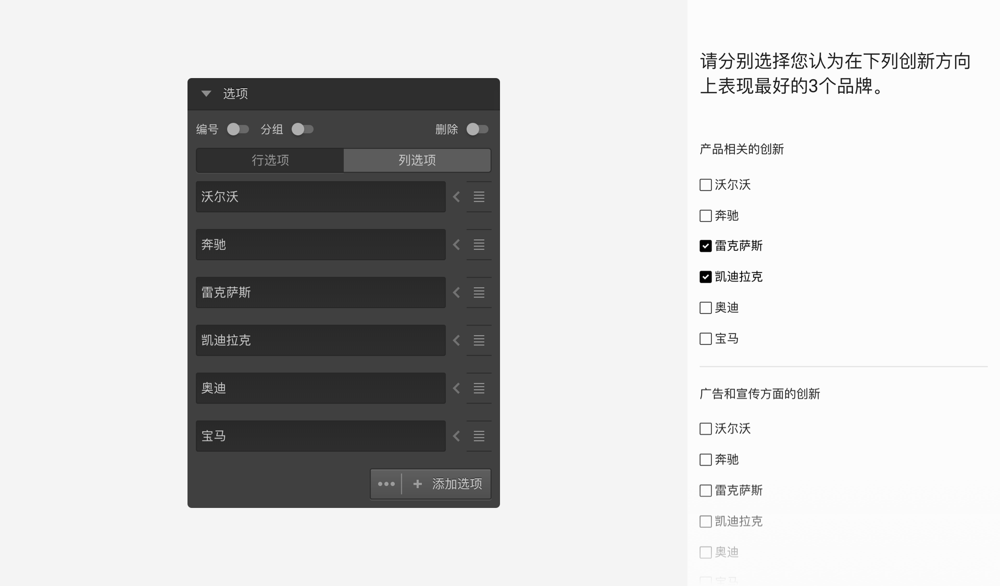
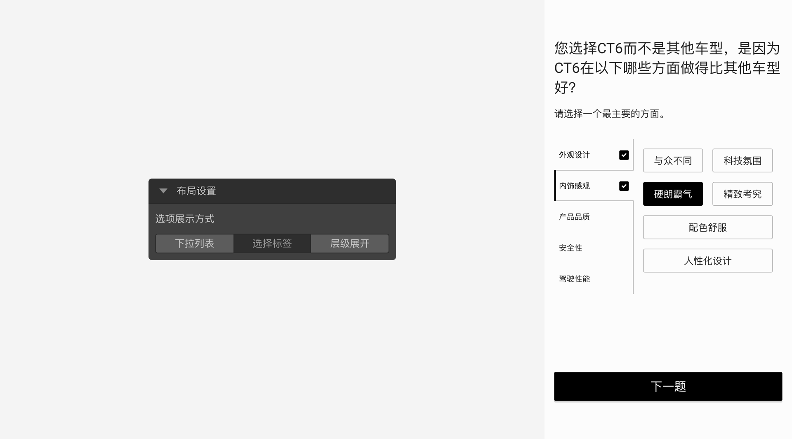
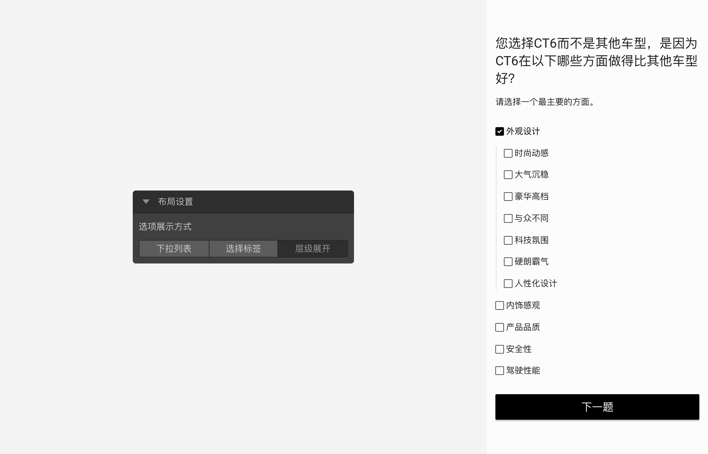

```index
8
```

```tag

```

```summary

```
# 级联题

> 不同题型或功能节点共有的通用设置在[节点设置](../node-setting/concept.md)中有讲解，此处只讲解级联题特有的功能。

`级联题`适用于选项存在层级关系的题目，以层层嵌套的方式展现层级关系，让被访者进行选择。


## 级联题的连接方式

级联题需要结合`菜单题`来实现。级联题题型本身可以看作是一个一级目录，连接的菜单题好比二级目录、甚至三级目录，最多支持三层嵌套的关系。级联题连接菜单题后，会自动获取菜单题的题目作为自己的选项，



如上图所示，级联题节点方框底部有个`级联开始`输出口，连接输出到菜单题。实质上，是[菜单题](./menu.md)节点充当级联的数据提供者，使用其他节点会报错。连接到 `级联开始`下面的菜单题，称为`级联数据组`。作为级联题数据的提供者的菜单题不再是独立的题目，答题过程中不会以题目形式单独出现。因此，级联数据组中菜单题的属性设置会有一些变化，具体是：

+ 必答题：表示所在级联层级必须做出选择；
+ 多选题：表示所在级联层级可多选，并可以指定多选数量范围；
+ 选项随机：表示所在级联层级展示时会打乱选项顺序；

级联题连接级联数据组后，级联题自动生成所有选项。改变级联题选项只能通过改变级联数据组的方式实现。

上图案例询问员工所在的职位：
+ 第一层，选择在上班所在地；
+ 第二层，选择所在的部门；
+ 第三层，因为不同部门的职位是不一样的，所以选择上班所在地和部门后，岗位选项会有所不同；
+ 被访者看到最终效果是，级联题先显示城市选择，选择城市后，选择不同部门，最后再选择不同的岗位；


## 选项展示方式

布局设置中可以单独控制所在级联层级的菜单弹出方式，系统提供了三种展示方式：
+ 下拉列表：每一层都使用下拉列表方式选择，选择后显示下级选项。

+ 标签选择：以左右分栏的列表方式进行选择，只支持两层级联嵌套。

+ 层级展开：像多层选择题一样展示，选中部分会层层展开，以供继续选择。


> 不同题型或功能节点共有的通用设置在[通用设置](../../11nodeSettings/concept.md)中有完整说明。