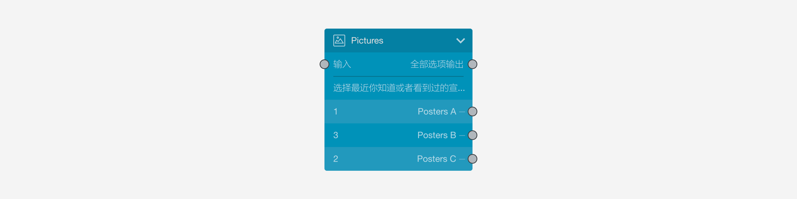
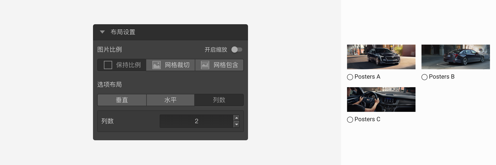
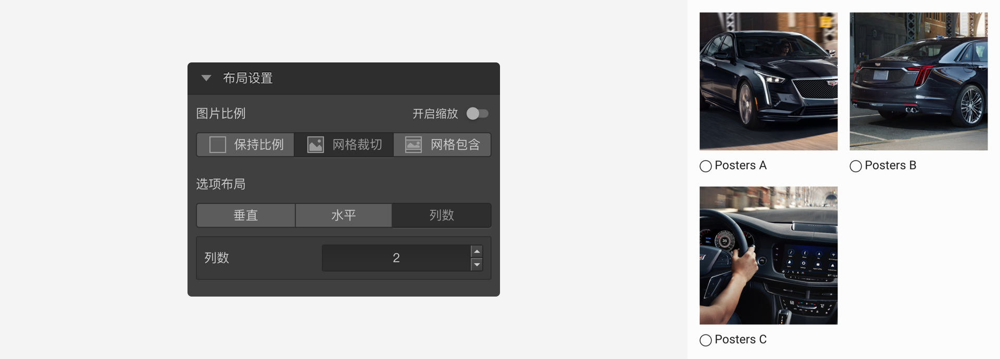
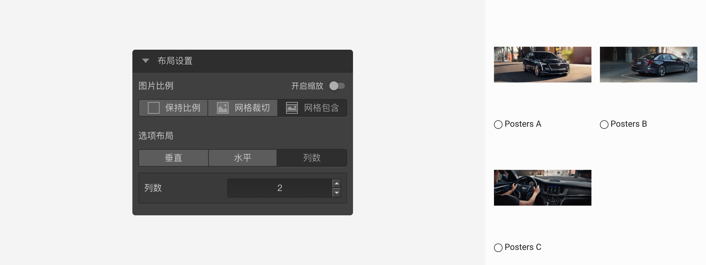
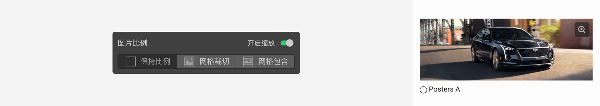

```index
10
```

```tag

```

```summary

```
# 图片选择题

`图片选择题`是选择题的另外一种形式，可以看作是把图片当成选项的选择题，各种设置与选择题相同。



图片选择题效果：


## 布局设置
用于控制图片展示方式。

### 图片比例：
用于控制图片的显示方式。

+ 保持比例：图片按原始比例显示，不会有裁切。



+ 网格裁切：图片自动撑满高度或者宽度，会有部分被裁切。



+ 网格包含：图片自动撑满选项网格容器，不会有裁切。



+ 开启缩放：

用于控制图片是否可以放大，开启后，选项图片右上角会显示一个`放大`按钮，点击后放大该图片。



### 选项布局：
用于控制图片选项的排列方式。可设定为`水平`排列、`垂直`排列和指定`列数`排列。

> 不同题型或功能节点共有的通用设置在[通用设置](../../11nodeSettings/concept.md)中有完整说明。