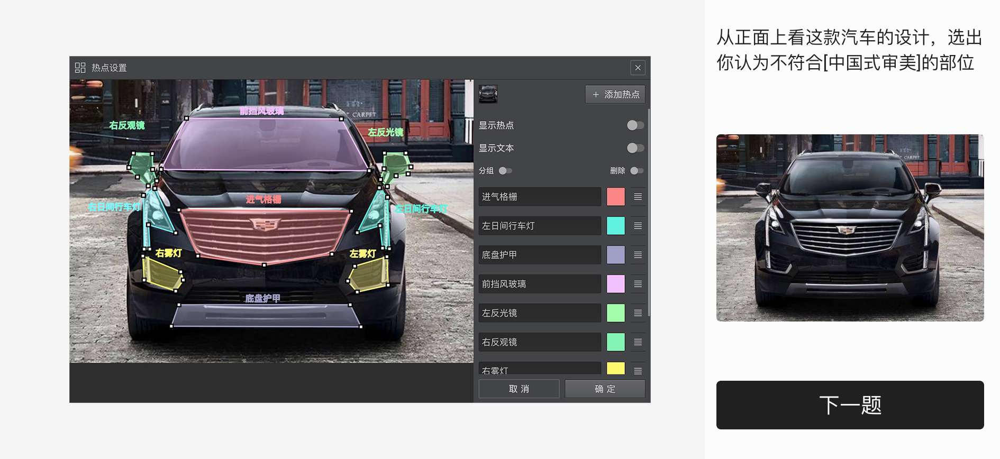
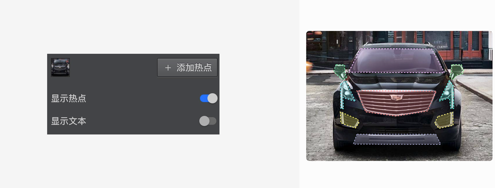

\```index

11

\```

\```tag

图片热点题 选项设置 布局设置 显示热点 显示文字 题型节点

\```

\```summary

图片热点题的使用说明。

\```

# 图片热点题

==图片热点题==会呈现一张图片给被访者，提示被访者在图片上点击关注的热点，答题过程中，被访者点中热点所在区域就代表选中对应选项。


## 选项设置

点击==编辑选项==按钮，打开==热点设置==对话框。图片热点题需要一张背景图片，点击对话框右上角的==图片选择器==添加一张背景图片。随后，点击==添加热点==按钮在背景图片上添加一个正方形热点，拖拽热点框到目标位置，点击==确定==完成设置。



图片热点题支持添加多个热点框，每个热点框就是一个选项。多个热点框之间不能重叠。答题过程中，被访者点中热点框就代表选中该选项。

## 布局设置

+ 显示热点：开启后，图片上会显示热点所在区域，提示被访者进行选择。



+ 显示文字：开启后，图片上会显示勾选框，提示被访者进行选择。


> 不同题型或功能节点共有的通用设置在[通用设置](../../11nodeSettings/concept.md)中有完整说明。