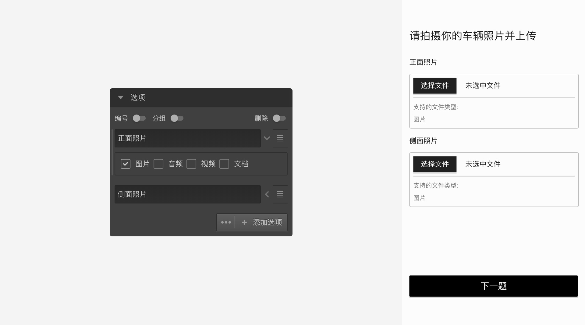

# 上传题

==上传题==允许被访者上传文件作为问卷题目答案。被访者上传的内容能可以被当作选项图片变量被后续节点引用。如果上传的是图片，则可以直接引用并显示这张图片；如果不是图片，则会自动生成一张显示文件名的图片并显示。

## 选项设置

+ 可上传文件类型：
上传题的每个选项都可以上传一个文件，点击选项附加设置图标，设置该选项允许上传的文件类型。

## 通用设置

+ 上传数量限制：
无论设定了多少选项，默认时，仅要求被访者上传任意一项即可。开启上传数量限制后，可以设置上传文件的最小数量和最大数量限制。

> 不同题型或功能节点共有的通用设置在[通用设置](../../11nodeSettings/concept.md)中有完整说明。