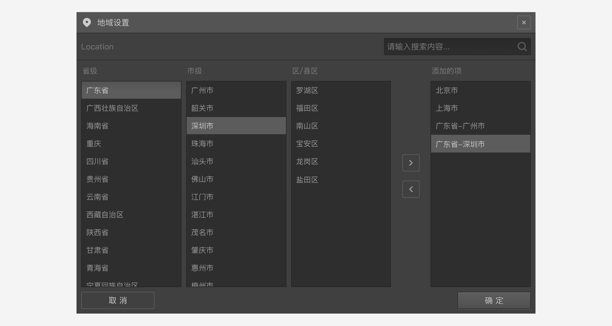
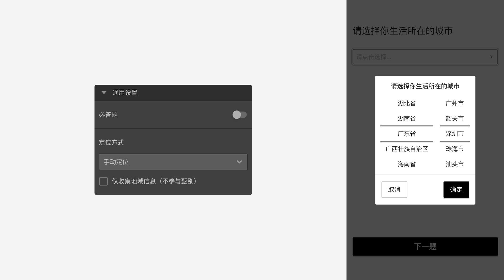
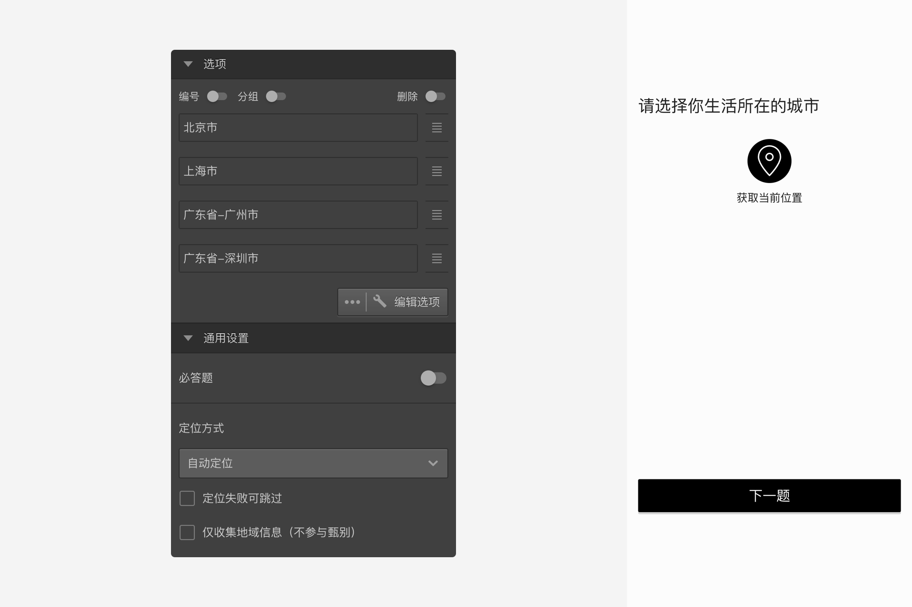
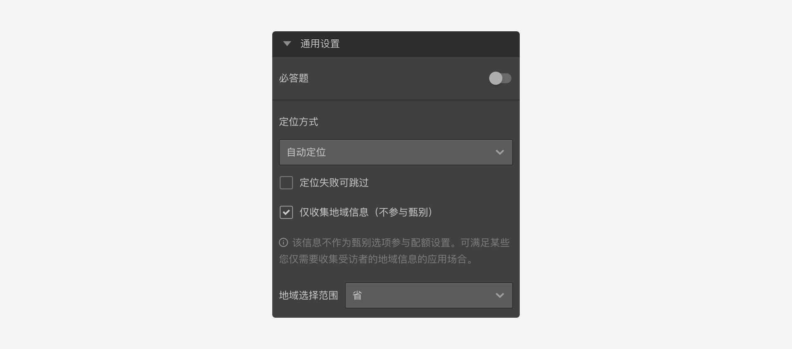

```index
14
```

```tag

```

```summary

```
# 定位题

`定位题`用于确定被访者当前所在的地理位置。


## 选项

`定位题`的选项只能从城市地域中选择。点击`编辑选项`，弹出`地域设置`面板，为定位题添加选项。



设置完毕后，被访者会在问卷页面上看到提示其进行定位的信息，点击`定位`按钮后，系统会自动获得被访者所在地理位置并选中匹配的选项。

> 定位题有一个固定的`其他`选项，用于归集无法识别的地理位置，该选项无法删除。如果定位匹配不到任何选项，则会选中`其他`选项。

## 通用设置

+ 定位方式

`定位题`支持`手动定位`和`自动定位`：
+ 手动定位：弹出列表让被访者选择自己所在位置；



+ 自动定位：页面显示一个定位图标按钮，被访者点击后，会使用被访者硬件系统的定位功能确定用户所在的位置。



> 如果因网络状况或用户终端权限设置的问题，可能会导致自动定位失败。

考虑到自动定位可能失败的情况，自动定位下面有一个`定位失败可跳过`的勾选项。勾选后，定位失败时会解除该题的必答限制，被访者可以继续后续问卷。


## 仅收集地域信息
开启后，定位题仅用于记录被访者的定位结果。

可以设置定位信息的不同精确度。

> 不同题型或功能节点共有的通用设置在[通用设置](../../11nodeSettings/concept.md)中有完整说明。