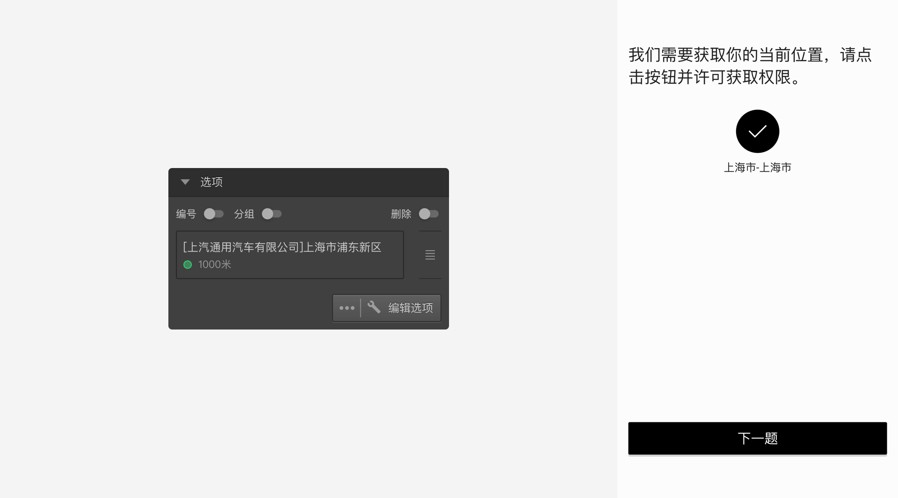
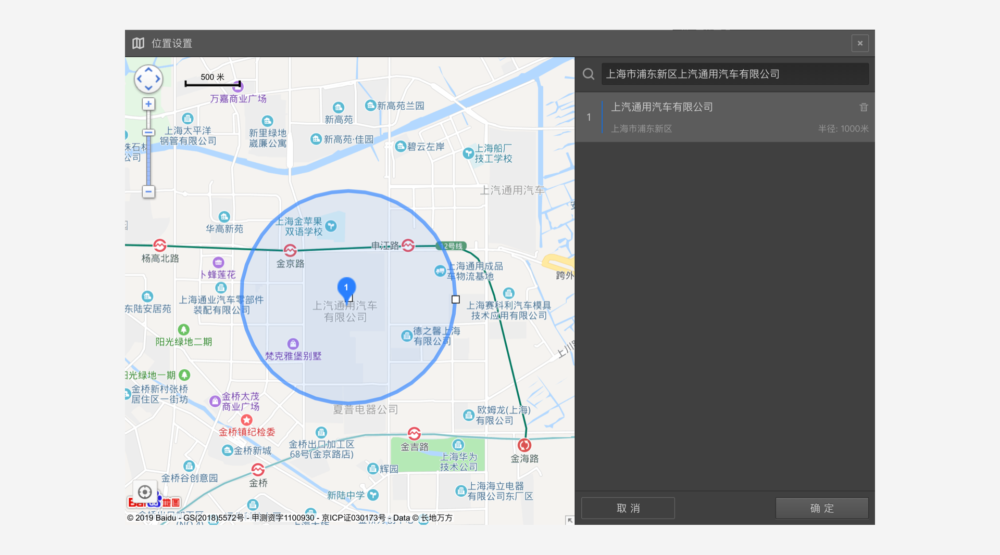

\```index

15

\```

\```tag

范围定位题 题型节点

\```

\```summary

范围定位题的使用说明。

\```

# 范围定位题

==范围定位题==允许在地图上设置位置点，并为每个位置点设置范围，被访者定位后，判断被访者是否在指定范围内。


点击右侧==属性编辑工具栏==中的==编辑选项==按钮，打开==位置设置对话框==。



在搜索框中输入目标名称，地图上会出现搜索结果位置点，点击结果位置点，会看到该点的地址信息标签，点击标签上的==添加==按钮，把该位置点设定为目标选项。以该目标选项为中心会出现一个圆圈，默认半径500米，拖拽圆圈上的小方块调整范围半径大小。



==范围定位题==可以添加多个位置点选项。默认情况下会有一个==其他==选项，这个==其他==选项不可删除。==范围定位题==在答题页面上会展示为一个定位图标，点击后会获得被访者定位信息，定位成功后，如果位置在某个选项的范围内，就会选中该选项，如果没有在任何选项的范围内，就会选中==其他==选项。

> 如果网络状况不好或因用户设置权限不足，可能导致自动定位失败。

> 不同题型或功能节点共有的通用设置在[通用设置](../../11nodeSettings/concept.md)中有完整说明。