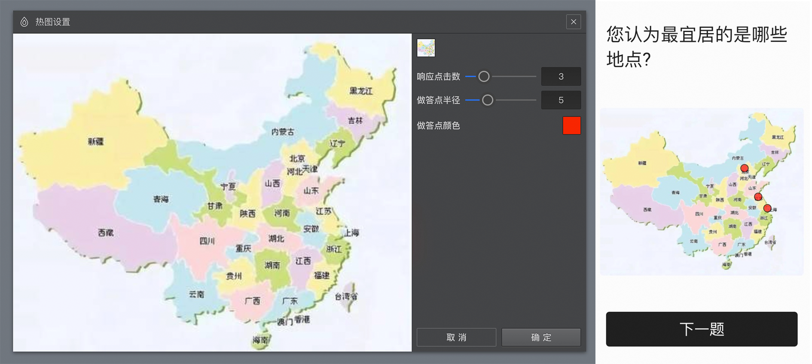

# 图片热力题

==图片热力题==会呈现一张图片给被访者，提示被访者在图片上点击关注的区域，答题过程中，被访者点中的区域就代表填入的对应选项。

## 选项设置

点击==设置热图==按钮，打开==热图设置==对话框。图片热力题需要一张背景图片，点击对话框右上角的==图片选择器==添加一张背景图片。随后，分别配置==响应点击数==，==作答点半径==，==作答点颜色==。点击==确定==完成设置。

图片热力题支持点击多个热点，每个热点位置就是一个输入项。答题过程中，被访者点选一个区域就代表该区域坐标作为该输入项。

> 不同题型或功能节点共有的通用设置在[通用设置](../../11nodeSettings/concept.md)中有完整说明。