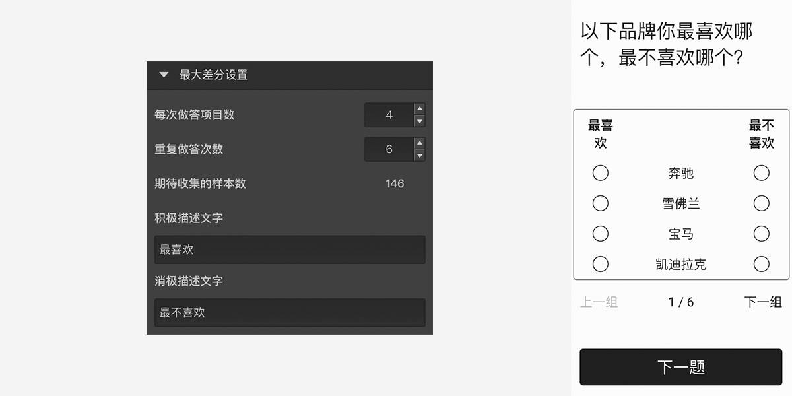

# 最大差分题

==最大差分题==提供多组选项给被访者，被访者从中选择两项作为问题的答案。答完所有的组即可进入下一题。

## 选项设置

+ 每次做答项目数

每组展示的选项数量

+ 重复做答次数

每个选项需要出现的次数

+ 期待收集的样本数

按选项数量、每次做答项目数、重复做答次数，最少需要回收到的样本数

+ 积极描述文字

每组选项中最积极选项的描述文字

+ 消极描述文字

每组选项中最消极选项的描述文字

> 不同题型或功能节点共有的通用设置在[通用设置](../../11nodeSettings/concept.md)中有完整说明。