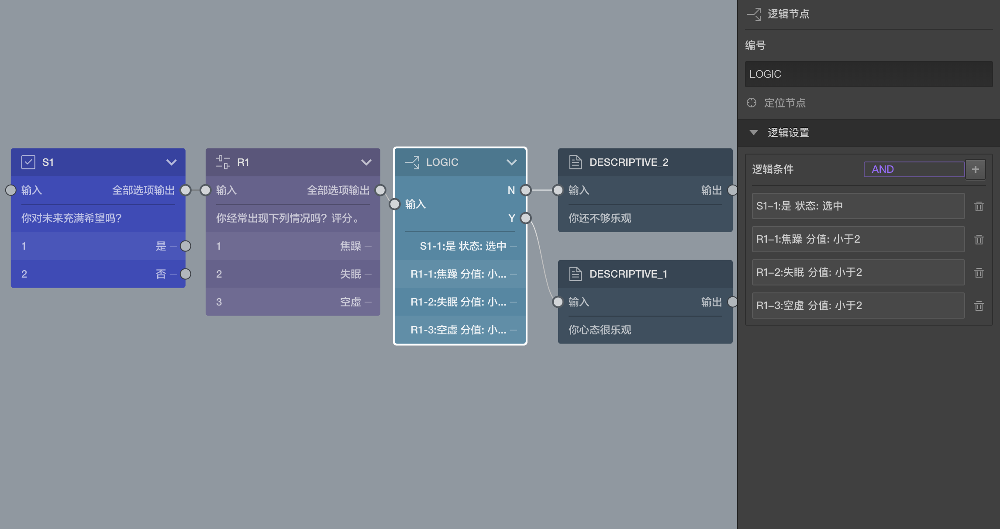

```index
1
```
```tag

```
```summary
逻辑节点用来判断逻辑条件，控制问卷流程走向。
```
# 逻辑节点

`逻辑节点`用来判断逻辑条件，从而控制问卷流程走向。`逻辑节点`用于完成一项功能操作，在答题页中不会被显示。

通过之前的文档，我们知道单选题的的选项可以用连线来决定选中该选项后的去哪里找到下一题，实现问卷题目跳转的功能。但是如果变成多选题，或者对于填空题、打分题等，因为它们的答案可能同时选中多个选项，无法通过连线解决。这类复杂的场景下，则需要用到逻辑节点，对题目的结果进行组合判断，从而决定下一题去哪里。



## 基本规则
`逻辑节点`在画布中会有2个输出口：
+ `Y`输出口：逻辑运算结果为`真`；
+ `N`输出口：逻辑运算结果为`假`；

逻辑节点中可以设置许多逻辑条件，每个逻辑条件都会计算得出最后为`真`还是为`假`。

多个逻辑条件进行组合判断时的，不同`逻辑类型`会影响组合判断的结果。`逻辑类型`分为`逻辑与(AND）`和`逻辑或(OR)`两种：
+ `逻辑与(AND）`：所有条件同时都为`真`，总结果才为`真`，也称为`AND`；
+ `逻辑或(OR)`：所有条件中只要有一个条件的结果为`真`，总结果就为`真`，也称为`OR`；

根据`逻辑类型`设定对多个逻辑条件进行运算，最终得出为`真`或者为`假`的结果。
+ 最终结果为`真`：后续会走`Y`输出口寻找下一道题目；
+ 最终结果为`假`：后续会走`N`输出口寻找下一道题目；

点击右侧`属性编辑工具栏`中逻辑设置中的`+`号打开`逻辑编辑面板`编辑逻辑条件。`逻辑类型`也在`逻辑编辑面板`里选择设定。设置完毕并点击`确定`后，这些条件就会应用到逻辑节点上，并会显示在`属性编辑工具栏`中。

## 案例
上图的问卷片段中，我们调查人群的生活态度，第一道选择题询问是否对未来充满希望，第二道打分题分别对三个症状在被访者身上出现的频率进行打分，分值越低代表出现频率越低，最后使用一个逻辑节点整合判断之前的回答情况，从而得出结论。

结合观察右侧`属性编辑工具栏`，里面包含四个条件：
1. `S1`中选中`是`；
2. `R1`中`焦虑`项评分小于`2`；
3. `R1`中`失眠`项评分小于`2`；
4. `R1`中`空虚`项评分小于`2`；

使用的逻辑类型是`逻辑与(AND）`：
+ 也就是当上述条件都满足时，这个逻辑节点的最终运算结果为`真`，下一题从`Y`输出口寻找到`DESCRIPTIVE_1`，将显示`你心态很乐观`；
+ 否则为`假`，下一题从`N`输出口寻找到`DESCRIPTIVE_2`，将显示`你还不够乐观`；

> 不同题型或功能节点共有的通用设置在[通用设置](../../11nodeSettings/concept.md)中有完整说明。

