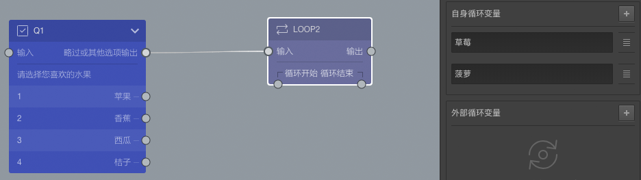

```index
2
```
```tag
循环节点 循环设置 自身循环变量 外部循环变量 循环变量 循环圈节点 案例 工具节点
```
```summary
循环节点用于对一组问题循环提问。
```
# 循环节点

`循环节点`可以根据被访者的选择，对一组问题进行循环问答操作。使用循环节点前，先要完成变量设定。随后，循环节点会根据变量设定的情况，对一组问题进行循环出题。循环的次数由设定变量的数量决定，设定了几个变量，即完成几次循环。

例如在问卷设计过程中，将循环节点前某道题目的选项B，选项C设定为变量。被访者在回答问卷时如果选择了选项B和选项C，就需要完成以变量B为条件的循环题和以变量C为条件的循环题。

## 循环设置
在画布中，循环节点除了输入口和输出口外，底部还有循环开始和循环结束口。
+ 循环开始是一个输出口，可以输出到另一个节点。
+ 循环结束是一个输入口，可以接受其他节点的输出。

具体使用方法是，从循环开始输出连接到一些题目，这些题目最后的输出又要作为输入连接到循环结束，这样就实现了一个循环。循环开始和循环结束之间的节点被称为`循环圈节点`。

使用`循环节点`时需要注意，参与循环的节点不能与循环之外的节点相互连接，也就是循环节点使用到的题目节点不能连接到`循环开始`和`循环结束` 外的节点。

选择`循环节点`，打开`属性编辑工具栏`，看到循环节点上可以设置[循环变量](../../16variable/10loopVariable.md)，包含`自身循环变量`和`外部循环变量`两种：

+ 自身循环变量

点击`自身循环变量`面板右上角的`+`按钮添加`自身循环变量`，`自身循环变量`是在`循环节点`内设置的需要循环的变量内容。是固定的。

+ 外部循环变量

点击`外部循环变量`面板右上角的`+`按钮添加`外部循环变量`，当前`循环节点`前的任何题目中的选项都能作为循环节点的`外部循环变量`。是动态的。

+ 循环圈节点

参与循环的所有题目节点。`循环圈节点`中的所有节点，都能使用`循环变量`，代表每次重复针对`循环圈节点`提问时使用的内容，这样就能达到通过变量展示不同内容的效果。

> 循环节点目前最多能支持2层循环。

## 变量循序随机

循环变量使用的顺序可被打乱，其打乱规则与[选项随机](../../11nodeSettings/05questionGeneralSetting/05randomOption.md)相同。

## 如何使用循环节点

+ 首先，设定需要送入循环的变量，变量必须为循环节点前的节点的选项。
+ 随后，创建需要进行循环的问题，按变量设定规则在问题中嵌入设定的变量。
+ 完成以上工作后，将循环第一题输入端连接到循环节点的循环开始，循环最后一题输出端连接到循环节点的循环结束，形成闭环。


上图第二个右侧编辑栏中，`R3`的问题文字中展示了循环变量的使用方法。

## 案例解决方案

上图的问卷片段是实现案例需求的解决方案，分为以下步骤：
1. 先通过选择题M1，从其他水果中让被访者选择一些自己感兴趣的水果，作为加入循环的水果；
2. 在循环节点LOOP_3中，自身循环变量设置为`猕猴桃`，`奇异果`，因为这两项是固定的、一定会提及的；
3. LOOP_3的循环圈节点只包含一个R3，R3的问题文字中引用了循环变量；
4. 外部循环变量使用了`M1/已选中的选项/选项文字`，这是[选项引用](../../11nodeSettings/04optionAdvancedSetting/01optionReference.md)的规则。正是这个设定，将之前被访者感兴趣的水果加入到循环里，与`猕猴桃`，`奇异果`一起循环出示；

问卷实际运行时，如果被访者在M3中选择了感兴趣的水果是`苹果`和`西瓜`，那么循环圈节点总共会被询问4次，分别是：
1. 请你对`猕猴桃`的以下方面进行评分。
2. 请你对`奇异果`的以下方面进行评分。
3. 请你对`苹果`的以下方面进行评分。
4. 请你对`西瓜`的以下方面进行评分。

如果问卷所有的条件和次数都是确定的，如：我们只调查`香蕉`、`桔子`、`西瓜`、`苹果`等10个水果，那么我们重复添加这10个选项到循环节点的`自身循环变量`，就可以实现针对20个水果在这三方面进行询问的需求，提高问卷编辑效率。

下面，我们再来看几个比较典型的案例。

## 举例1：创建外部循环变量
1、创建非循环题（正式题）
打开新增节点面板，创建一道选择题，完成设定。


+ 编号：Q1
+ 问题：请选择您喜欢的水果
+ 选项：苹果/香蕉/西瓜/桔子

2、创建循环节点

创建一个循环节点。增加`外部循环变量`，选择`Q1/全部选项/选项文字`完成设定。


+ 编号：Loop1
+ 外部循环变量：Q1/全部选项/选项文字

3、创建循环问题

创建一道的选择题、一道打分题，在题目内容中输入`@`，在弹出菜单中选择`LOOP1/循环文字`完成设定。


+ 编号：Q2
+ 问题：你您购买`LOOP1/循环文字`时关注以下哪个方面？
+ 选项：口感/外观/新鲜度
+ 编号：Q3
+ 问题：您每月会购买`LOOP1/循环文字`买多少次？
+ 分值：0——10
+ 选项：每月购买次数
 
4、创建非循环题（正式题）

打开新增节点面板，点击或拖动基本节点栏中的选择题，进行填充。


+ 编号：Q4
+ 问题：您通常通过哪种方式购买水果？
+ 选项：超市/社区小店/网购/马路摊位
 
上述循环设定的内在逻辑是：
+ 被访者在Q1的选择内容会替换掉循环节点所连接的Q2和Q3题目中的循环变量。如果被访者回答Q1时选择`西瓜`，则进入循环题后回答针对以`西瓜`提问的Q2、Q3题，最后再回答Q4。
+ 如果Q1设定为多选题，则会自动对所有被选项提问。如果被访者回答Q1时选择`西瓜`和`桔子`,则进入回答分别针对以`西瓜`和`桔子`提问的Q2、Q3题，也就说Q2、Q3会出现2次，最后再回答Q4。

## 举例2：创建内部循环变量
1、创建非循环题（正式题）

打开新增节点面板，创建一道选择题，完成设定。


+ 编号：Q1
+ 问题：请选择您喜欢的水果
+ 选项：苹果/香蕉/西瓜/桔子

2、创建循环节点

创建一个循环节点。增加`内部循环变量`，增加草莓、菠萝，完成设定。



+ 编号：Loop2
+ 自身循环变量：草莓、菠萝

3、创建循环问题

创建一道的选择题、一道打分题，在题目内容中输入`@`，在弹出菜单中选择`LOOP2/循环文字`完成设定。


+ 编号：Q2
+ 问题：你您购买`LOOP2/循环文字`时关注以下哪个方面？
+ 选项：口感/外观/新鲜度
+ 编号：Q3
+ 问题：您每月会购买`LOOP2/循环文字`买多少次？
+ 分值：0——10
+ 选项：每月购买次数
 
4、创建非循环题（正式题）

打开新增节点面板，点击或拖动基本节点栏中的选择题，进行填充。


+ 编号：Q4
+ 问题：您通常通过哪种方式购买水果？
+ 选项：超市/社区小店/网购/马路摊位

上述循环设定的内在逻辑是：
由于`内部循环变量`是必须会被循环题目所使用到的，所以被访者回答Q1时无论选择哪一个选项，都要分别回答以草莓为变量的Q2、Q3题，和以菠萝为变量的Q2、Q3题和以苹果为变量的Q2、Q3题，最后再回答Q4。

## 举例3：创建嵌套循环题（2层）
在循环圈中再接入1个循环节点，在循环中增加1层循环，从而实现嵌套循环。并且，第2层循环中，题目和选项可以应用到第1层和第2层的所有循环变量。

1、创建非循环题（正式题）

打开新增节点面板，创建一道选择题，完成设定。


+ 编号：Q1
+ 问题：请选择您喜欢的水果
+ 选项：苹果/香蕉/西瓜/桔子

2、创建循环节点

创建一个循环节点，完成设定。


+ 编号：Loop2

3、创建循环问题

创建一道的选择题，在题目内容中输入`@`，在弹出菜单中选择`LOOP2/循环文字`完成设定。


+ 编号：Q2
+ 问题：你您购买`LOOP2/循环文字`时关注以下哪个方面？
+ 选项：口感/外观/新鲜度

4、创建嵌套循环节点

创建一个循环节点，完成设定。
+ 编号：Loop3
+ 自身循环变量：伏特加、威士忌
  
5、创建嵌套循环问题

创建一道的选择题，在题目内容中输入`@`，在合适位置插入`LOOP2/循环文字`和`LOOP3/循环文字`完成设定。


+ 编号：Q3
+ 问题：你认为`Loop2:循环文字`与`Loop3:循环文字`的混合果汁味道会怎么样？
+ 选项：会好喝/不会好喝

6、创建非循环题（正式题）

打开新增节点面板，点击或拖动基本节点栏中的选择题，进行填充。


+ 编号：Q4
+ 问题：您通常通过哪种方式购买水果？
+ 选项：超市/社区小店/网购/马路摊位

上述循环设定的内在逻辑是：
+ 被访者回答Q1时无论选择哪一个选项，都要先回答Q2，并且Q2中会插入LOOP2的所有内外部循环变量。
+ 随后，在LOOP3中，会混合LOOP2的选项文字与LOOP3的内部循环变量进行提问。
    
    例如：被访者Q1选择了西瓜、香蕉，系统会以西瓜为变量提问Q2，随后会分别询问西瓜混合伏特加、西瓜混合威士忌为内容的Q3；最后，再以香蕉为变量提问Q2和Q3。
+ 随后，离开LOOP3循环，再离开LOOP2循环，回答Q4。

## 循环相关的变量
  在参与循环的题目内容中插入标签`@`，系统自动弹出变量列表，与循环相关的变量主要有：
+ 循环文字：引用循环变量中的文字，这是最常用的使用方式；
+ 循环图片：引用循环变量中的图片；
+ 循环索引：循环会对相同题目进行多次出示，每次循环时索引值都会递增，通过循环索引值，可以知道当前是第几次循环；
+ 循环分值：引用循环变量中的分值；
+ 循环备注：引用循环变量中的备注文字；
+ 循环编号：引用循环变量中的选项编号；

> 不同题型或功能节点共有的通用设置在[通用设置](../../11nodeSettings/concept.md)中有完整说明。