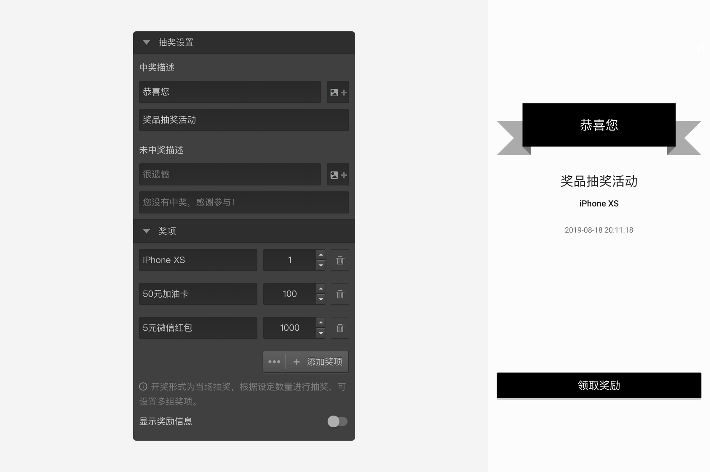
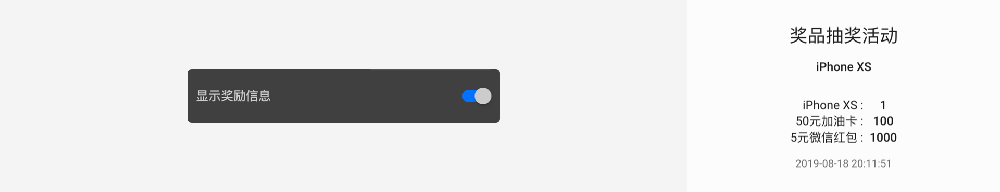

# 抽奖节点

==抽奖节点==连在==结束节点==之后、==奖励节点==之前，作为==结束节点==和==奖励节点==间的桥梁，作用是按照设定的中奖策略决定当前被访者可以领取到的奖励。

## 抽奖设置

+ 中奖描述和未中奖描述
设置中奖和未中奖时候显示的页面文字和图片。

+ 奖项
可以设置一等奖、二等奖等多个奖项，画布中的每个奖项都有一个输出口可以输出到==奖励节点==。如果抽中某个奖项就会跳到该奖项对应的==奖励节点==，具体的奖励内容由奖励节点的设置具体决定。

如上图，设定的抽奖策略是：

|奖项|数量|
|:-:|:-:|
|iPhone XS|1|
|50元加油卡|100|
|5元微信红包|1000|

> 每个奖项必须设定具体的数量。

## 显示奖励信息

开启后，抽奖页面上会显示各个奖项名称和他们的数量。

> 不同题型或功能节点共有的通用设置在[通用设置](../../11nodeSettings/concept.md)中有完整说明。
