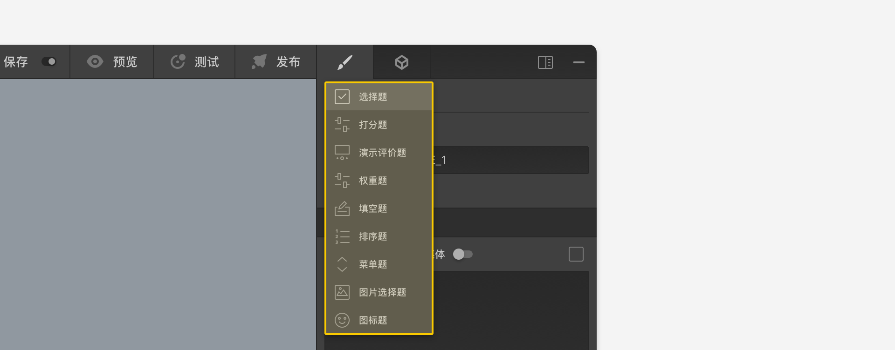

```index
1
```
```tag

```
```summary

```
# 题型切换和题目编号

节点`设置面板`的头部区域显示了当前节点的`类型`、`编号`信息，和`定位节点`按钮。


## 题型切换
点击`节点类型`名称弹出`节点类型转换`菜单，显示了当前节点可切换的其他题型。在不同题型之间转换时，只有题型之间共有的设置才会被保留，非共有的设置及其相关的连线也会被自动丢弃，以适应转换后的新题型。



## 题目编号
`编号`是节点在问卷里的唯一标记，问卷中不能存在编号相同的题型节点。创建节点时，系统会自动分配唯一的编号，编号可以修改，设置成具有明确意义的节点编号能提升工作效率。

## 定位节点：
点击`定位节点`，该节点会被移动到画布的中央。
