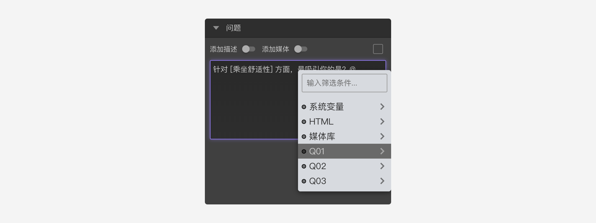
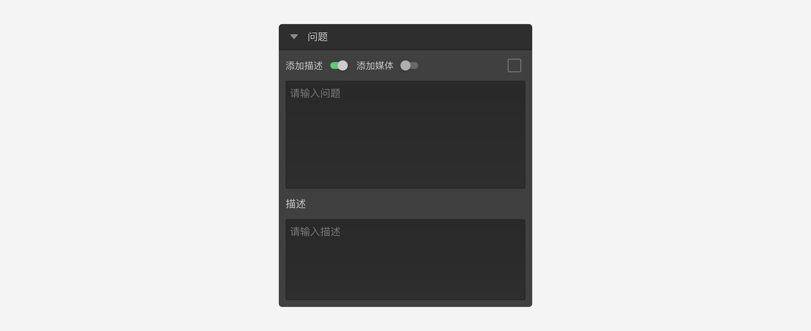

```index
2
```
```tag

```
```summary

```
# 问题内容和描述

用于设置问题题目内容、题目附加描述和媒体资源等属性。


## 题目内容
输入问题的文字内容。文字内容中可以插入变量的内容。例如：先询问被访者喜欢什么水果，然后追问被访者喜欢这个水果的具体原因。


## 题目描述
开启后出现`问题描述`输入框，可以在问题文字的基础上增加辅助描述。



