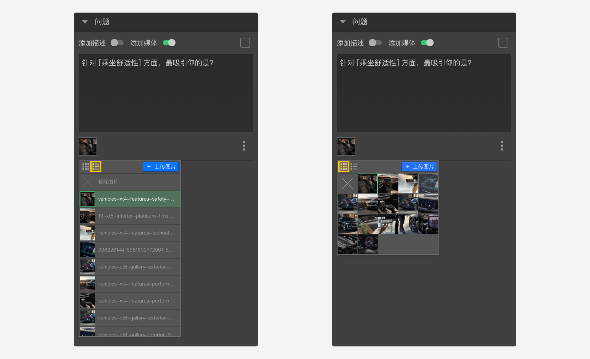
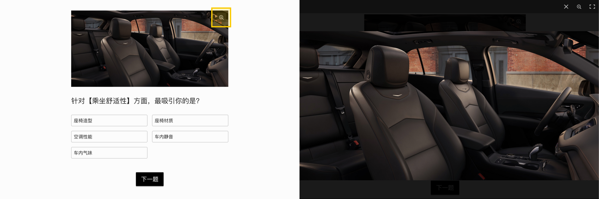
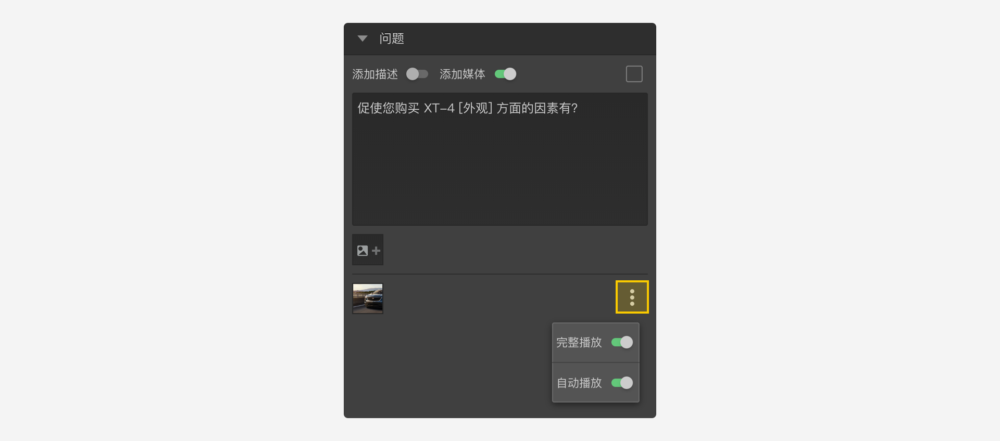

```index
3
```
```tag

```
```summary

```
# 题目图片和视频

开启节点的`添加媒体`开关。

## 添加题目图片
点击`图片媒体选择器`弹出图片资源列表，显示了当前媒体库中的所有图片资源，点击图片资源选择该图片。


添加图片后，会在问卷内容下方显示当前题目的配图。


+ 上传图片：
如果媒体库中还没有需要的图片，点击右上角的`上传图片`按钮上传图片并直接使用，同时这个图片也会添加到媒体库中。

+ 删除图片：
点击频资源列表最上面的`移除图片`按钮移除题目的当前图片。

## 图片媒体控制
+ `布局`：设定图片显示在`问题之前`或`问题之后`。
+ `开启缩放`：允许图片放大显示。
  


开启后，被访者点击图片可以进入全屏看图模式，放大查看完整图片。



## 添加题目视频
点击`视频媒体选择器`弹出视频资源列表，显示了当前媒体库中的所有视频资源，点击视频资源选择该视频。


+ 上传视频：
如果媒体库中还没有需要的视频，点击右上角的`上传视频`按钮上传视频并直接使用，同时这个视频也会添加到媒体库中。

+ 删除视频：
点击频资源列表最上面的`移除视频`按钮移除题目的当前视频。

### 视频媒体控制


+ `完整播放`：被访者必须看完视频是才能进入下一题的。
+ `自动播放`：进入题目时，自动播放视频。

> 由于手机生态系统普遍存在深度定制的现象，`自动播放`在某些定制的手机系统中可能会失效。

