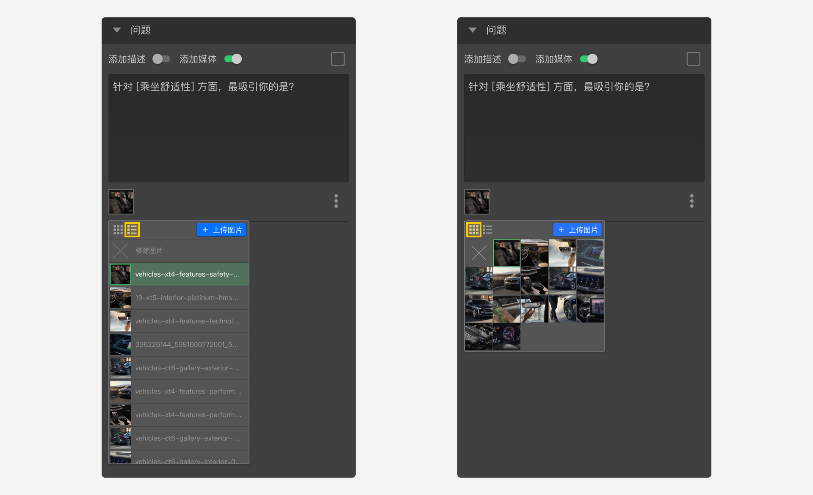
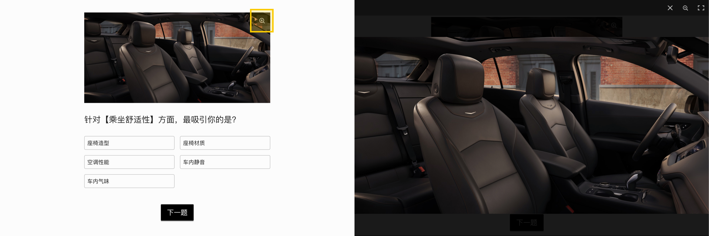
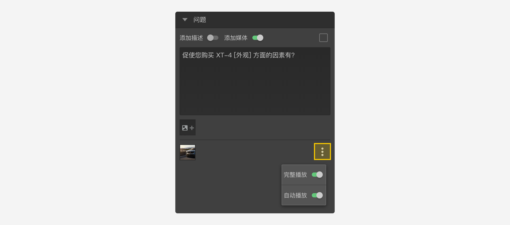

```index
2
```
```tag

```
```summary

```

# 问题设置

用于设置问题题目内容、题目附加描述和媒体资源等属性。


## 题目内容
输入问题的文字内容，文字内容中可以插入变量的内容。例如：先询问被访者喜欢什么水果，然后追问被访者喜欢这个水果的具体原因。


## 题目描述
开启后出现`问题描述`输入框，可以在问题文字的基础上增加辅助描述。


## 添加媒体
开启后出现[图片选择器](../media/image.md)和[视频选择器](../media/video.md)。


+ 图片：

  打开`图片媒体选择器`，从图片资源库选择一张图片，也可以上传的新的图片。
  

  + 添加图片：
  点击`问题设置`面板中的`图片媒体选择器`就会出现一个图片资源列表，显示当前媒体库中的所有图片资源，点击图片资源选择该图片。

  + 上传图片：
  如果媒体库中还没有需要的图片，点击右上角的`上传图片`按钮上传图片并直接使用，同时这个图片也会添加到媒体库中。

  + 删除图片：
  点击频资源列表最上面的`移除图片`按钮移除题目的当前图片。

  + `开启缩放`：允许图片放大显示。
  
  开启后，被访者点击图片可以进入全屏看图模式，放大查看完整图片。
  

+ 视频：
  打开`视频媒体选择器`，从视频资源库选择一段视频，也可以上传的新的视频。
  

  + 添加视频：
  点击`问题设置`面板中的`视频媒体选择器`就会出现一个视频资源列表，显示当前媒体库中的所有视频资源，点击视频资源选择该视频。

  + 上传视频：
  如果媒体库中还没有需要的视频，点击右上角的`上传视频`按钮上传视频并直接使用，同时这个视频也会添加到媒体库中。

  + 删除视频：
  点击频资源列表最上面的`移除视频`按钮移除题目的当前视频。

  + `完整播放`：被访者必须看完视频是才能进入下一题的。
  + `自动播放`：进入题目时，自动播放视频。
  

  > 由于手机生态系统普遍存在深度定制的现象，`自动播放`在某些定制的手机系统中可能会失效。

## 题目标签
可以给题目添加自定义标签，标签主要用途是使数据表格更加简明。对于比较长的问题文字，可能会影响数据结果表格的视觉效果。如果设置了该标签，则结果中会以标签内容代替问题内容，否则使用问题文字。如下图，为当前问题设定了“乘车舒适性”标签文字，在数据结果中，这道题目的列名就会以“乘车舒适性”来命名。
  

