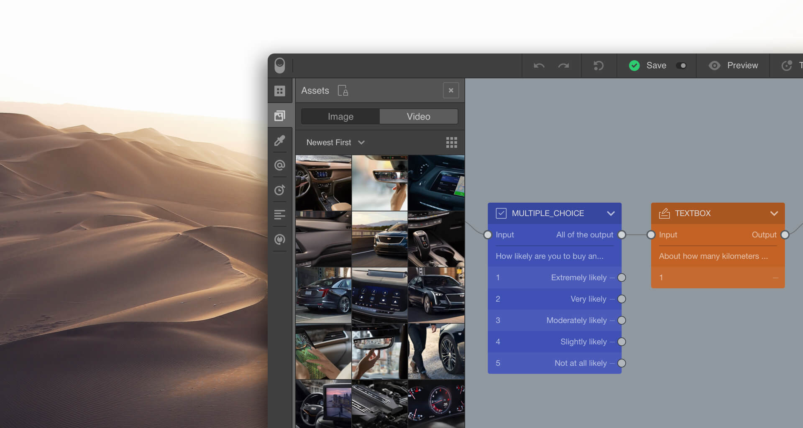
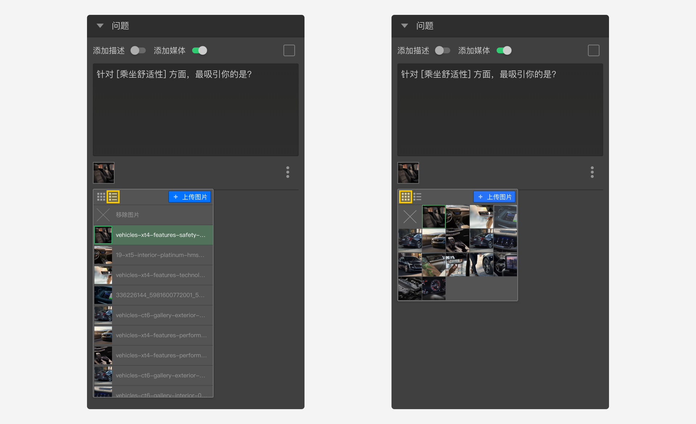

```index
1
```
```tag

```
```summary

```
# 媒体资源


问卷中经常要使用到图片或视频，这些图片或视频就是媒体，媒体资源在[媒体库](../layout/toolbar.md#媒体库)中被统一管理。

媒体资源分为：

+ [图片资源](./image.md)
+ [视频资源](./video.md)

## 上传媒体资源
打开`媒体库`面板，上传图片或视频到媒体库。

当需要使用时，开启节点的`添加媒体`开关，点击`图片媒体选择器`和`视频媒体选择器`，从`图片媒体选择器`和`视频媒体选择器`菜单中也可以上传新的媒体资源。
  