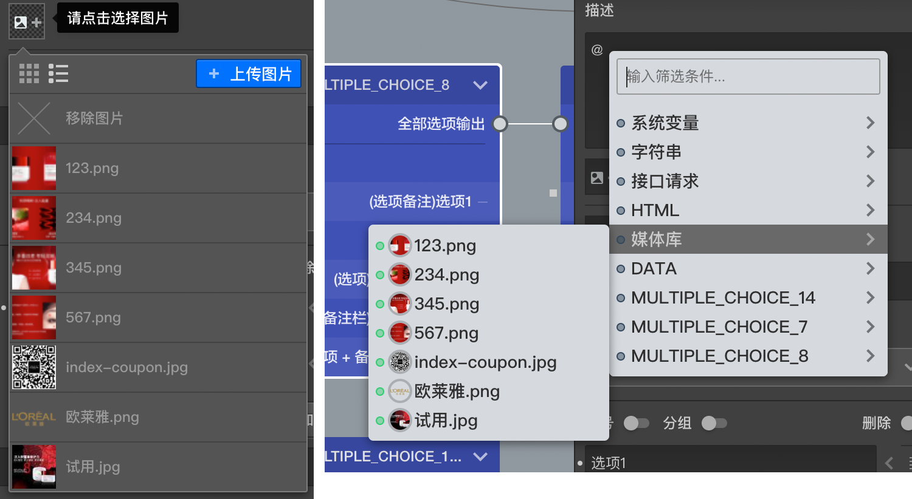

```index
2
```
```tag

```
```summary

```
# 图片资源
这里介绍如何使用图片资源，图片资源允许以2种方式被使用，分别为`普通设置方式`和`富文本框内嵌方式`。



上图左侧为`普通设置方式`，右侧为`富文本框内嵌方式`。

## 普通设置方式

通过普通设置使用图片的地方都会放置一个`图片选择器`，点击图片选择器就会出现`图片资源列表`，展示当前`媒体库`中的所有图片资源，点击列表中的图片就可以选择该图片。如果问卷中曾经创建过媒体变量，则当前节点能访问到的媒体变量也会在列表的末尾列出，以供选择。

如果媒体库中还没有你想使用的图片，点击右上角的`上传图片`按钮上传图片并直接使用，同时图片也会自动添加到媒体库中。点击`图片资源列表`最上方的`X`按钮移除当前选中的图片。

主要在以下设置中可以使用普通设置使用图片资源：
+ [问题设置](../node-setting/question.md)；
+ [图片题](../nodes/picture.md)和[演示评价题](../nodes/slide-rate.md)的选项中；
+ [图片热点题](../nodes/hot-spot.md)的热图设置中；
+ [问卷封面](../nodes/start.md)设置中；
+ [全局设置自定义logo](../layout/global-setting.md)；
+ [抽奖节点](../nodes/lottery.md)的中奖描述和未中奖描述中；
+ [视频库](../layout/toolbar.md#媒体库)中作为视频的封面；

## 富文本框内嵌方式

`富文本框`是指获得输入焦点后边框显示为紫色的输入框，这些输入框中可以用内嵌的方式引用变量。在富文本框输入`@`符号，显示包含媒体变量和媒体库图片的变量选择列表，点击选择媒体资源将其当作变量内嵌到文本框中，被访者答题过程中，系统会解析出该媒体变量代表的媒体资源并显示出来。

> 关于变量使用的详细说明，参见[变量使用](../variable/usage.md)。
