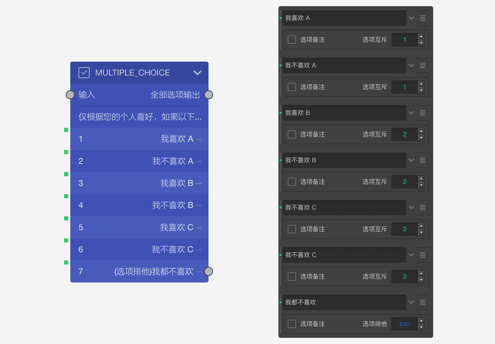

# 选项分组和排他

## 选项分组

开启==分组==开关，打开选项分组输入框。相同分组编号的选项为同一组。

选项分组会在[选项随机](../../11nodeSettings/05questionGeneralSetting/05randomOption.md)中分组随机相关场景中使用，一般不需要进行分组。

# 选项排他

在多选题中，有时选项间会存在一种互相排斥的关系。当选了某个选项时，另外一个就不应该被选中，这时候就要用到==选项排他==功能。

因为单选题不存在互斥的可能性，因此只有多选题才能显示==选项排他==设置。开启==多选题==后，打开选项的[附加设置](../../11nodeSettings/03optionSetting/06additionalSetting.md)，就能看到==选项排他==设置框。点击设置框右边的箭头按钮切换设定不同的排他模式：

## N（或Null）

代表该选项不排他。

## 1-9的数值

代表互斥编号，可设定为1-9之间的数值，当该选项被选中时，会排除与自己互斥编号相同的选项以及==EXC==的选项；

如下图，选项排他编号相同的选项间具有互相排斥的关系。

## EXC

表示该选项与所有其他选项排斥，只要选中该选项## 他任何选项都自动会被取消选中，当选中任何其他选项时，这个选项也会自动被取消选中。

