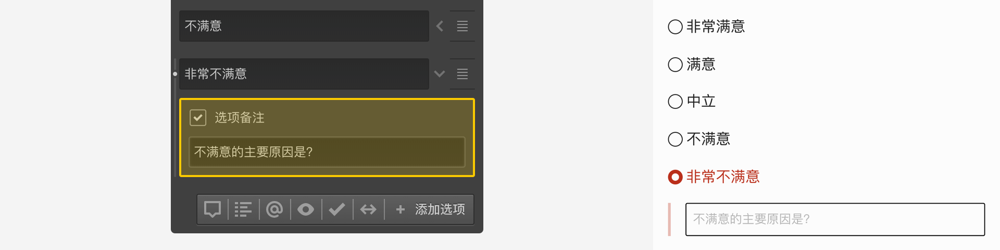

\```index

3

\```

\```tag

选项备注 选项设置 节点设置

\```

\```summary

选项备注用于被访者选择选项后，提示其进一步地输入备注说明文字。

\```

# 选项备注

==选择题==默认包含一个==选项备注==的附加设置。点击选项右侧箭头，并开启==选项备注==后，当选中该选项时，下方会出现要求输入备注文字的输入框。



==选项备注==与==其他==选项的==选项+备注方式==非常类似，区别是==其他==选项的==选项+备注方式==支持输入验证。