```index
4
```
```tag

```
```summary
对被访者输入的内容进行格式验证，拒绝接收不符合格式要求的数据。
```
# 输入验证

对于填空题选项、选项备注栏等需要输入任意内容的地方添加输入验证规则，可限制输入指定类型的数据，防止收集到无用的内容。

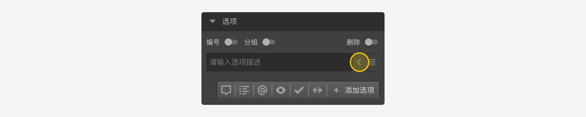

点击这些选项右侧的`附加设置`小箭头按钮，打开输入验证选项面板。

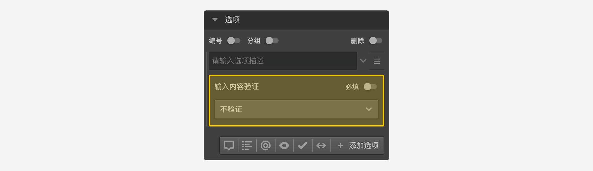

## 必填
开启`必填`开关，代表该项必须输入内容，不输入则会报错，且不能进入下一题。

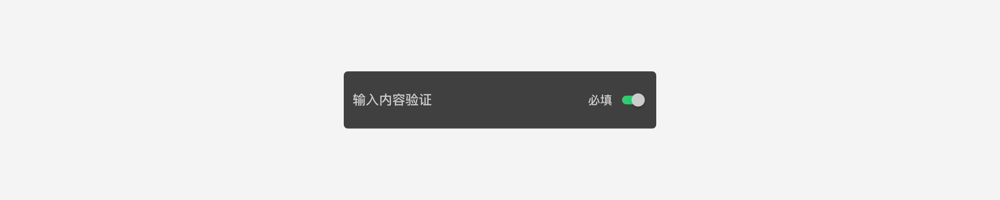

## 内容验证
检查输入是否满足指定格式，如果不满足则报错。点击设置面板中的下拉列表可以选择验证规则。

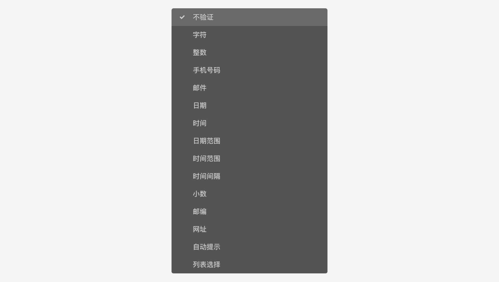

以下是内置验证规则的说明：

+ 字符

表示可以输入各种文字，数字或符号。

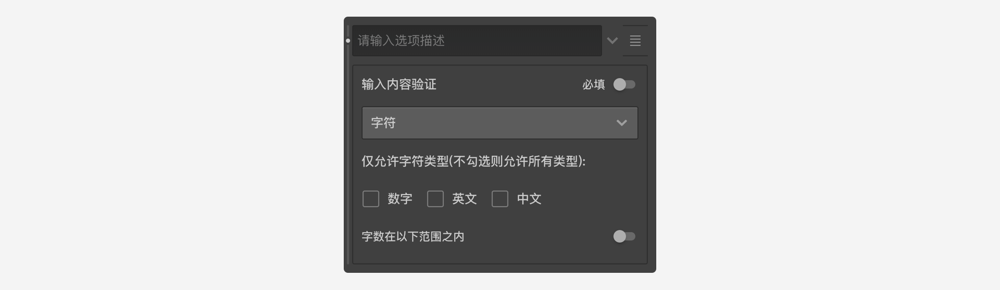

选中字符规则后，会出现三个勾选框：`数字`、`英文`、`中文`用于限制输入字符的类型，如果不勾选任何项目，则表示允许所有字符，当勾选指定项目后，表示只允许输入所选规则的字符。

可以设置输入字符数量的范围。

+ 整数

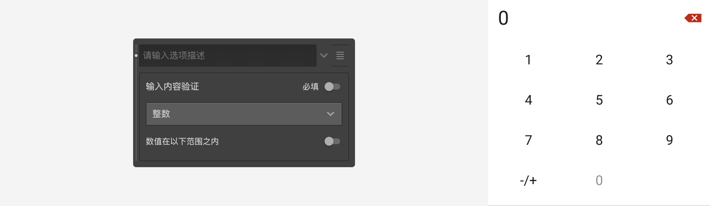

可以设置输入整数的值的范围。

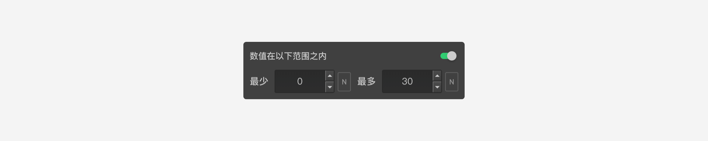

+ 手机号码

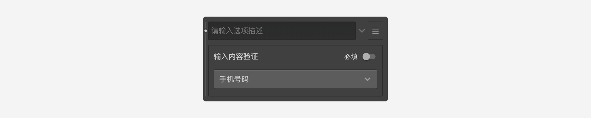

+ 邮件


+ 日期

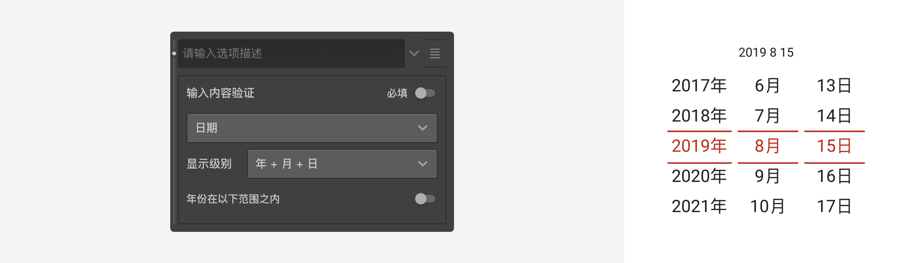

+ 时间


+ 日期范围


+ 时间范围

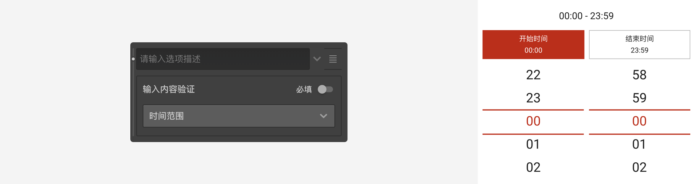

+ 时间间隔

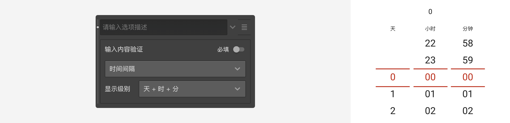

+ 小数

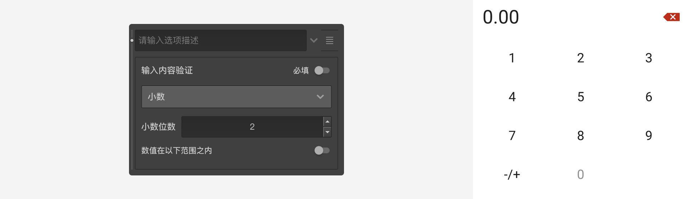

+ 邮编

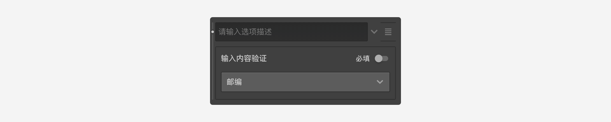

+ 网址

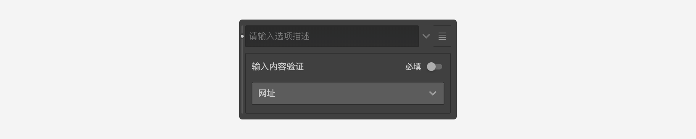

+ 自动提示

选择该类型时，当被访者在输入框中输入内容时，会根据输入的内容弹出提示标签，被访者选择提示标签作为真正的输入内容，任意输入的内容是无效的。

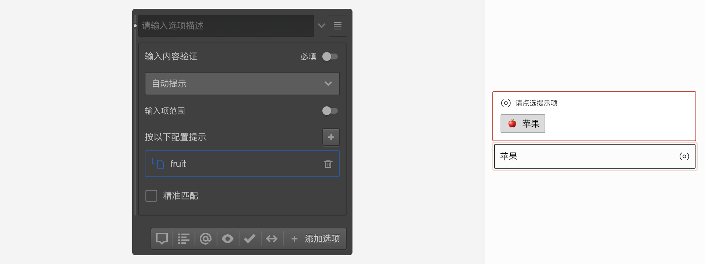

使用时，先要上传自动提示配置文件。如下图，Brand就是一本配置文件，用于指示系统如何根据用户的输入，弹出对应的匹配项。

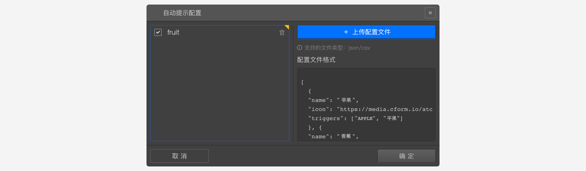

自动匹配默认采取宽泛的弱匹配方式，以返回更多的选项供被访者选择。如下图中，被访者输入`平果`时，会匹配到`苹果`。

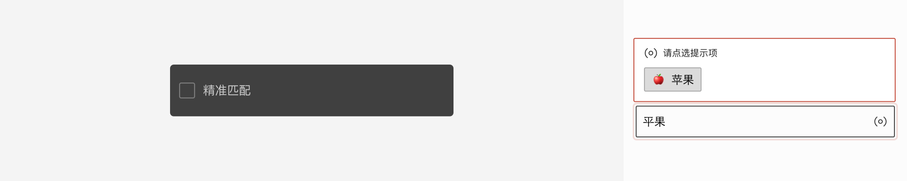

打开`精准匹配`，采取严格的匹配方式，此时输入`平果`时，则不会匹配到任何对象。


> 自动提示配置具体规则参见[自动提示](../../15advancedOptionSetting/01autoComplete.md)。

+ 列表选择

选择该类型时会出现一个下拉列表配置框，在里面配置列表项，列表项以半角逗号作为分隔符。

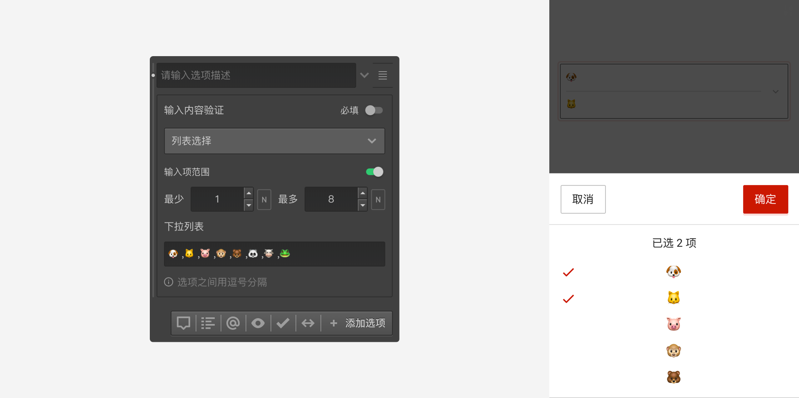

可以控制选择项目数量的范围。被访者回复问卷时，点击输入框后出现选择项列表，从中选择作为输入内容。


