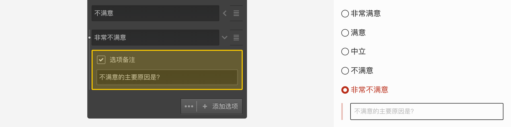

```index
6
```
```tag

```
```summary

```
# 附加设置
有些选项的输入框和排序图标之间会有个箭头图标，点击箭头图标打开该选项的`附加设置`。不同题型的`附加设置`各有不同。
下图是打开选择题`附加设置`后，可将当前选项开启为`选项备注`，当被访者选择`非常不满意`后，将会提示要求输入不满意的具体原因。


> 在`附加设置`中进行过设置的选项，对应选项的前面会有个小白点作为提示标记。